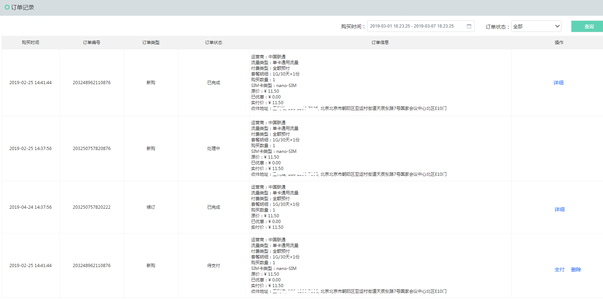

# 订单管理

进入“订单记录”页，您可以查询订单记录详情信息。

在线购买物联网卡的订单类型为“新购”，在“物联网卡管理”页面进行续订产生的订单类型为“续订”。

发起支付，未进行支付的订单状态为“待支付”，待支付的订单支持“支付”和“删除”操作；订单支付成功后，订单状态为“处理中”，处理中的订单京东云第一时间为您邮寄物联网卡，当您收到物联网卡的时候，订单状态变更为“已完成”，已完成的订单，您可以点击“详细”按钮查询物联网卡的相关信息。

