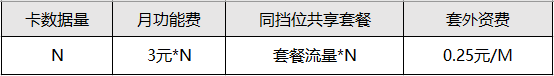

# 计费概述
## 一、商品定价
根据在商品详情页的规格选择，会产生不同的单价。

* **SIM卡属性**：

物联网卡是专供物联网设备使用的SIM卡

SIM卡的运营商类型等属性不会影响单价
* **流量套餐**

流量套餐是指物联网卡的上网流量套餐

不同流量套餐的大小是影响单价的决定性因素
## 二、强制激活
中国移动：从卡开户开始，若六个月内没有使用，会在六个月后的次月1日被强制激活

中国联通：从卡开户开始，若360天内没有使用，会在360天后的次日被强制激活

中国电信：从卡开户开始，若六个月内没有使用，会在六个月后的次月1日被强制激活
## 三、销户规则
中国移动：流量套餐到期后，若90个自然日内没有订购新的流量套餐，SIM卡将被销户

中国联通：流量套餐到期后，若90个自然日内没有订购新的流量套餐，SIM卡将被销户

中国电信：流量套餐到期后，若90个自然日内没有订购新的流量套餐，SIM卡将被销户
## 四、同档位共享流量类型
1、相同档位套餐的单卡组成共享流量池，同档位共享流量只有月套餐，例如10张1G卡组成10G流量池

2、每张卡不做流量达量断网，当整体使用量超过共享池总量时，多出流量按照套外费用计算

3、同档位共享套餐不能订购叠加包，不能改套餐，只支持当前档位续订

4、套餐内流量包预付费，超套流量后付费

