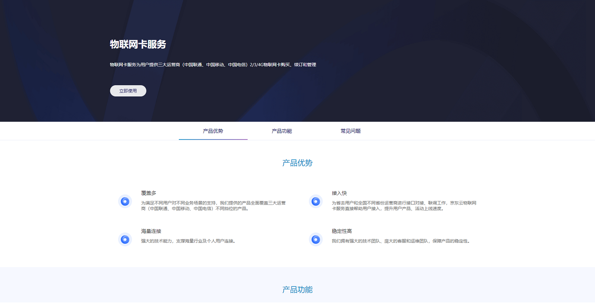

# 购买流程

本文介绍 物联网卡 实例的购买入口。

## 入口1：产品介绍页
1. 登录京东云官网[https://www.jdcloud.com/](https://www.jdcloud.com/)。
2. 选择“产品>云通信>物联网卡服务”。
3. 弹出的产品介绍页，点击**立即购买**。

## 入口2：控制台

1. 登录京东云官网[https://www.jdcloud.com/](https://www.jdcloud.com/)。
2. 选择“控制台”，具体见下图。

3. 登录控制台，具体操作请参考[物联网卡购买](../Getting-Started/Create-Instance.md)。
