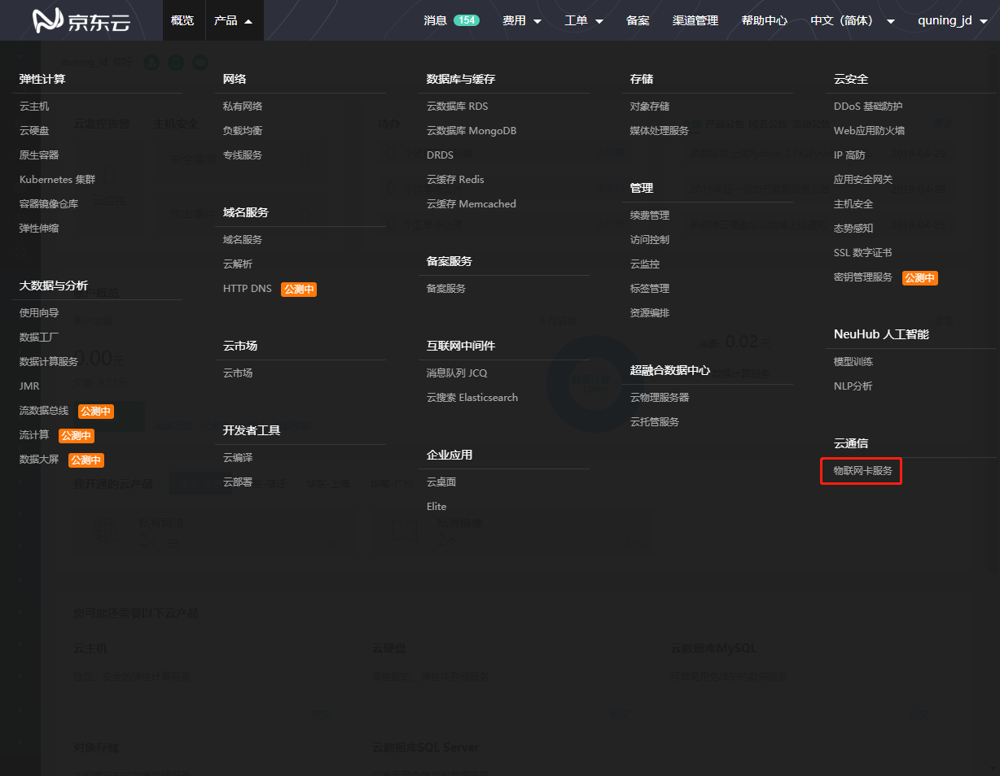
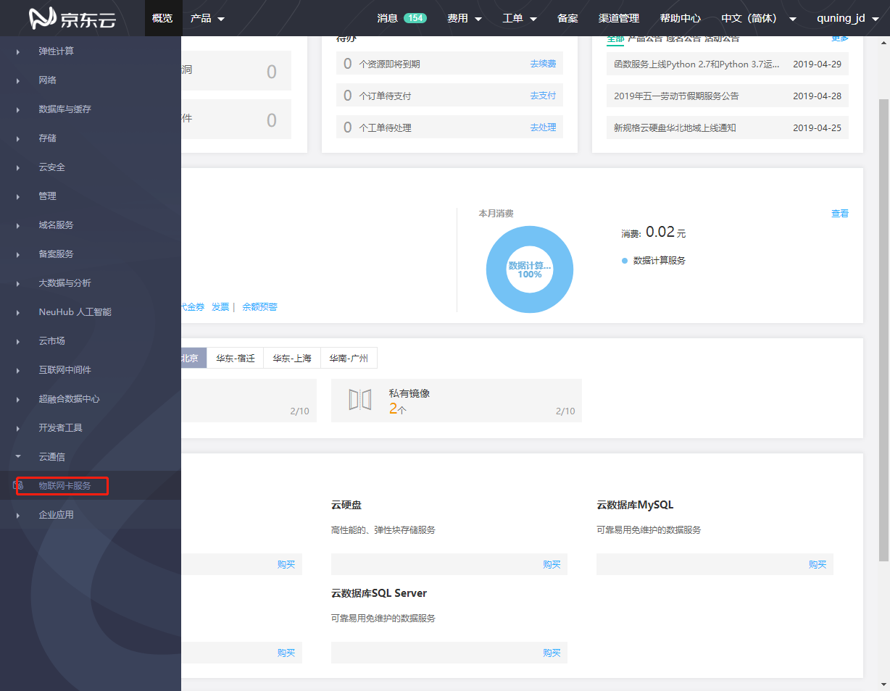
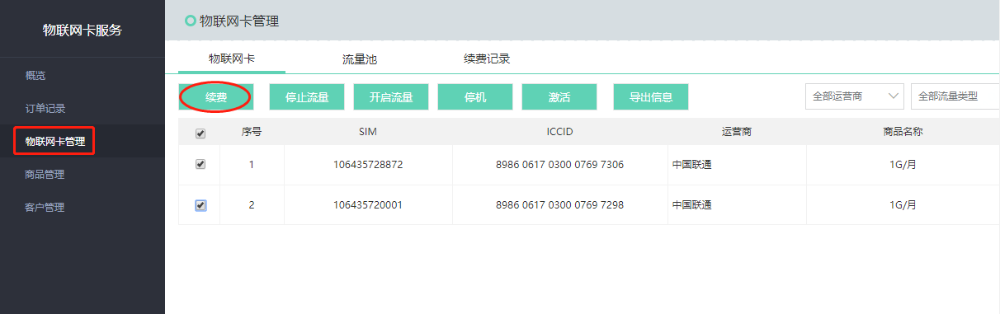

# 续费流程

本文介绍物联网卡续费入口。

1. 进入[京东云控制台](https://console.jdcloud.com/overview)。
2. 通过页头导航，依次点击 **产品** > **物联网卡服务**，进入物联网卡服务平台。

也可以通过左侧菜单，依次点击 **云通信** > **物联网卡服务**，进入物联网卡服务平台。

3. 进入物联网卡服务平台，点击左侧“物联网卡管理”菜单，进入管理页面，在管理页面选择需要续费的卡号，点击 **续费**，进入“续费页面”。

