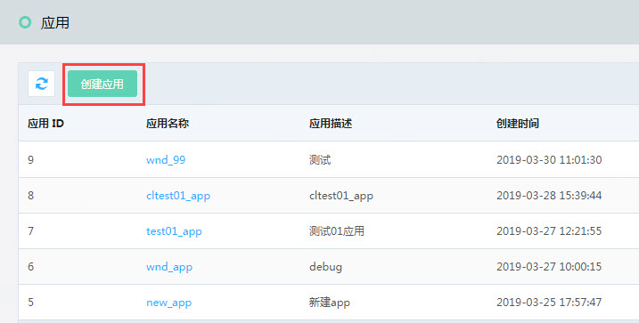
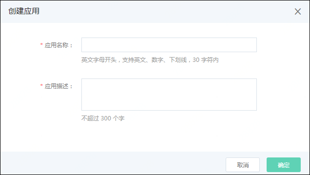
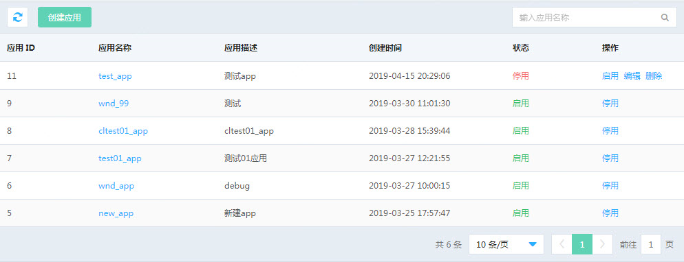
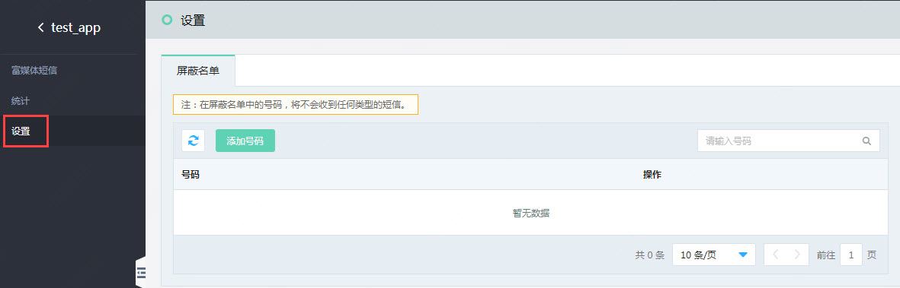
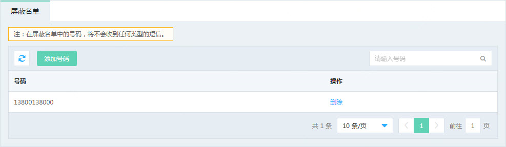

## 应用管理 
在使用京东云富媒体短信服务发送短信前，需要先创建应用，应用创建完成，您可以获得该应用的唯一标识码AppID (应用ID) 和用来校验短信发送请求合法性的密码 AccessKey 。 

**创建应用:** 
登录京东云账号后, 进入富媒体短信服务, 在左侧菜单中选择 “应用管理”,在打开的页面中点击“创建应用”按钮 
  
在弹出的创建应用界面中填写应用名称和应用描述, 信息填写完成后点击确定, 页面会跳转到应用列表, 您在应用列表可以看到你刚才添加成功的应用.  
  

**管理应用:** 
在应用列表页面上，您可以查看该应用的短信使用情况，停用、启用、编辑或删除该应用。  
   
应用创建后为启用状态, 此时您可以进行停用操作, 列表中应用的状态将变为 ‘停用’ , 停用后京东云将停止该应用的富媒体短信服务. 
如果您想继续是用该应用可点击 ‘启用’, 启用后将可正常使用富媒体短信服务  

**应用设置** 
点击应用名称后, 进入到该应用的设置页面 
   
 
**屏蔽名单** 
   
在屏蔽名单中的号码，将不会收到任何类型的短信。  