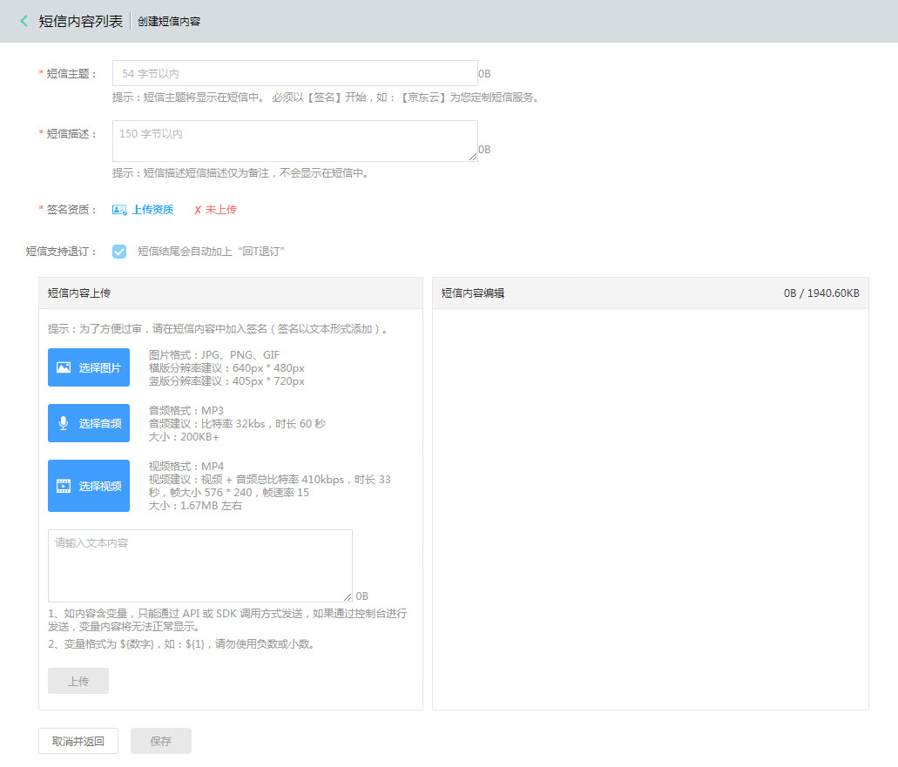
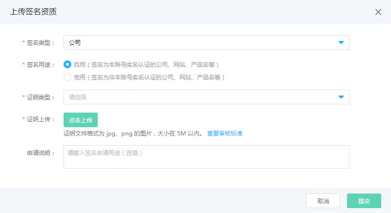
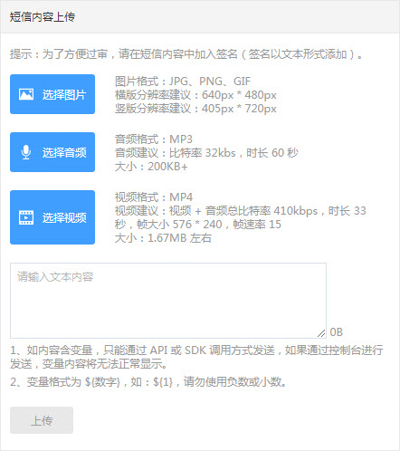
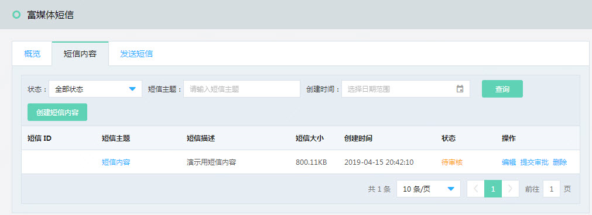

## 创建富媒体短信  

登录富媒体短信服务后, 首先您要先创建应用.   
  
创建应用后, 在短信签名TAB页, 点选 ‘短信内容’, 如下图  
  
点击 “创建短信内容” 后进入到富媒体短信内容创建页面.  
  
短信主题:  
手机用户收到富媒体短信时显示的主题内容. 其中主题中必须已【签名】开始,如: 
【京东云】为您定制短信服务  
短信描述:  
短信描述不会出现在手机用户短信, 仅供企业备忘使用.   
签名资质: 
根据提示内容填写并上传资料证明 
  
短信内容上传: 
  
您可以上传图片, 音频, 视频, 点击上传后, 附件将进入到右侧编辑区域, 可以上传多次附件, 但上传附件的总量不能超过 1.9MB.   
附件要求如下: 
图片要求： 
格式：JPG、PNG、GIF 
分辨率建议：横版640px * 480px，竖版405px * 720px  
音频要求： 
格式：MP3 
音频建议：比特率32kbs，时长:60秒 
大小：200K+  
视频要求： 
格式：MP4 
视频建议：视频+音频总比特率410kbps，时长：33秒，帧大小576*240，帧速率：15 
大小：1.67M左右  
文本内容: 
文本内容支持变量, 变量格式为  &#36;{1} &#36;{2}… 
如内容含变量,只能通过API或SDK调用方式发送, 如果通过控制台进行发送, 变量内容将无法正常显示.  
短信内容编辑: 
   
上传后的附件都会在短信内容编辑区显示, 您可以通过调节附件上下位置进行排版.  
注: 不通手机机型显示会有所不同: 
- iOS预览居左显示，短信标题加粗 
- Android预览居左显示，短信标题加粗，每个短信内容之间有数字分隔 

短信编辑完成后, 点击保存返回列表页. 提交审批后您可以在短信列表页查看审核状态, 审核通过后的短信, 才能用于发送 
  
