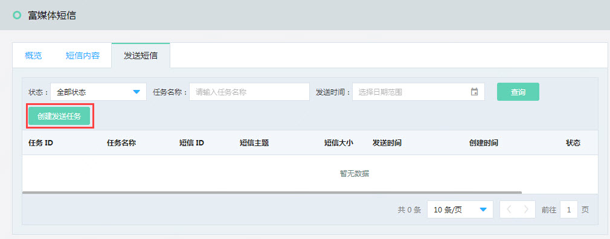
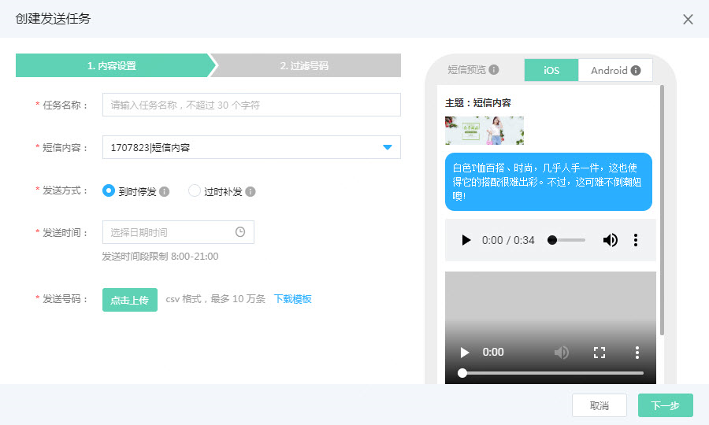
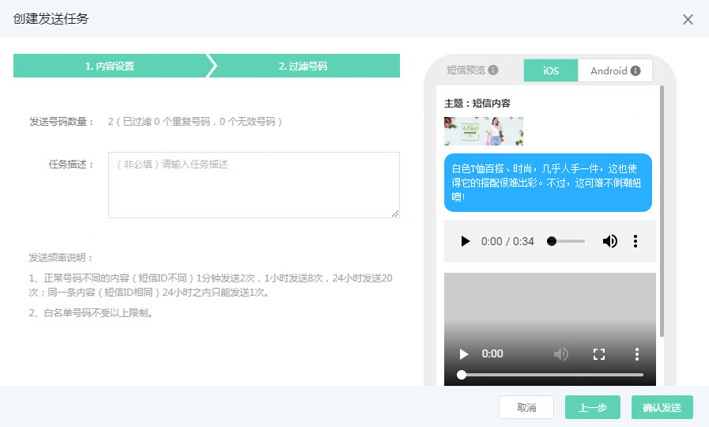
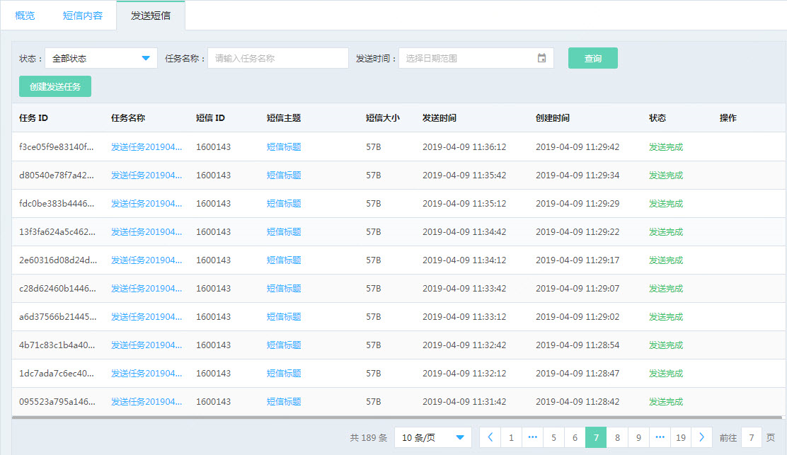

短信审核通过后, 就可以开始创建发送任务了, 在发送短信TAB页, 点选 ‘创建发送任务’, 如下图  
  
在内容设置界面中填写相关资料, 并选择已审核通过的 ‘短信内容’  
  
设置发送时间并根据格式要求上传手机号后,点击下一步  
推广短信发送时间: 每日 8:00-21:00  
发送频率限制: 
正常号码不同的内容（数字短信ID不同）1分钟发送2次，1小时发送8次，24小时发送20次；同一条内容（数字短信ID相同）24小时之内只能发送1次；  
  
核对发送的信息后, 点击确认发送, 完成短信任务创建 
注: 系统将自动过滤掉重复的手机号  
  
您可以在发送短信列表页查看短信发送状态. 