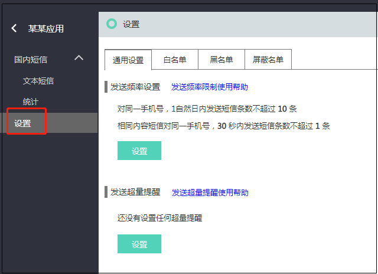
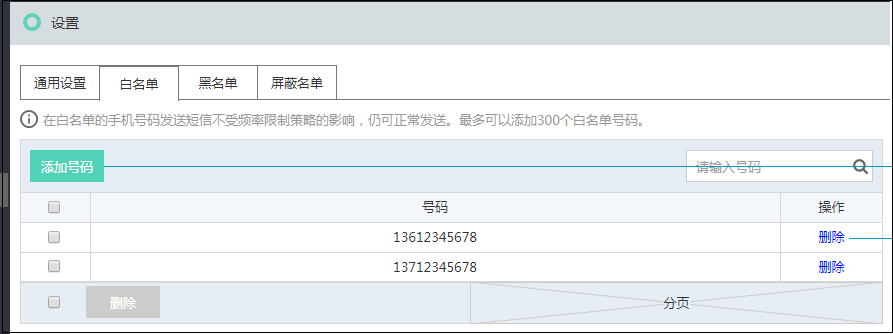
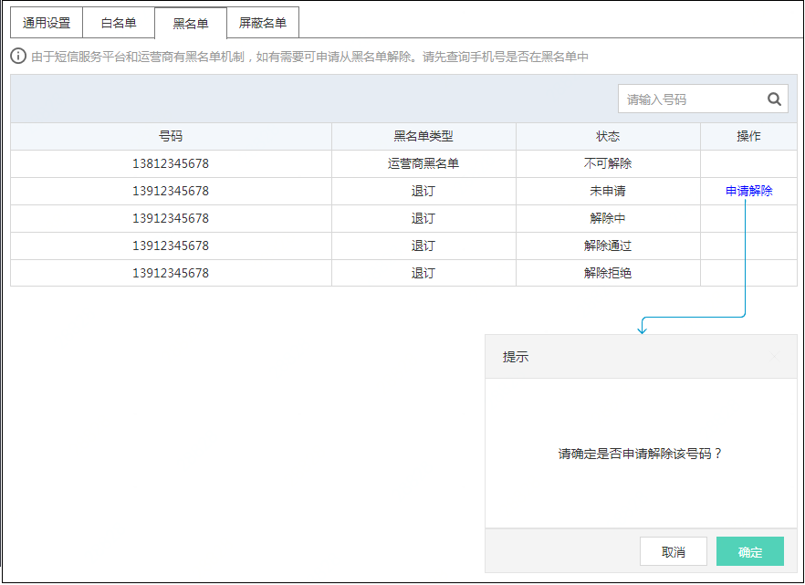

## 应用管理 

在使用京东云短信服务发送短信前，需要先创建应用，应用创建完成，您可以获得该应用的唯一标识码AppID (应用ID) 和用来校验短信发送请求合法性的密码 AccessKey 。  

**创建应用:** 
登录京东云账号后, 进入短信云服务, 在左侧菜单中选择 “应用管理” 
  

在弹出的创建应用界面中填写应用名称和应用描述, 信息填写完成后点击确定, 页面会跳转到应用列表, 您在应用列表可以看到你刚才添加成功的应用. 
  

**管理应用:** 
在应用列表页面上，您可以查看该应用的短信使用情况，停用、启用、编辑或删除该应用。 
  
应用创建后为启用状态, 此时您可以进行停用操作, 列表中应用的状态将变为 ‘停用’ , 停用后京东云将停止该应用的短信服务. 
如果您想继续是用该应用可点击 ‘启用’, 启用后将可正常使用短信服务  

**应用设置** 
点击应用名称后, 进入到该应用的设置页面 
  

发送频率设置: 
为了保障业务和通道安全，减少业务被刷后的经济损失，短信默认的频率限制策略为： 
1.	对同一手机号，1自然日内发送短信条数不超过10条  
2.	相同内容短信对同一手机号，30秒内发送短信条数不超过1条  

发送超量提醒: 
当勾选 “每个自然日国内短信请求量超过X条提醒”后, 系统将根据您的阈值向您已绑定的手机号发送提醒短信  

白名单:  
 
在白名单的手机号码发送短信不受频率限制策略的影响，仍可正常发送。最多可以添加300个白名单号码。  

黑名单: 
 
于短信服务平台和运营商有黑名单机制，如有需要可申请从黑名单解除。请先查询手机号是否在黑名单中, 然后点击 ‘申请解除’ 等待审核.  

屏蔽名单: 
  

在屏蔽名单中的号码，将不会收到任何类型的短信。
