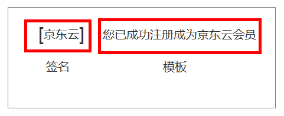
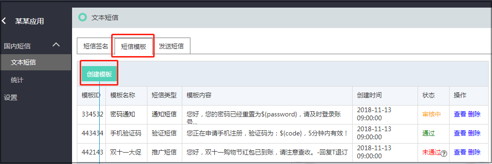

## 短信模板  

  

最终用户收到的短信样式如下:  
[京东云] 您已成功注册成为京东云会员  

在短信模板TAB页, 点选 ‘创建模板’, 如下图 
  

根据提示内容填写模板内容, 点击提交后等待运营人员进行签名审核 
  
目前仅支持推广类型短信, 营销短信和验证码短信将在近期上线.   

提交审核后您可以在短信模板列表页查看审核状态, 审核通过的短信模板可用于短信发送 
  