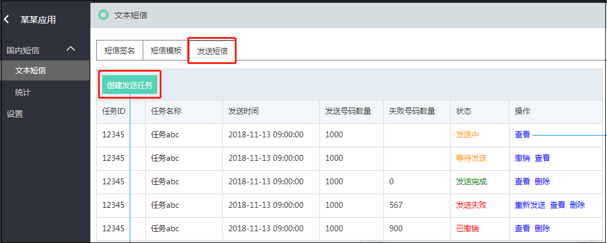
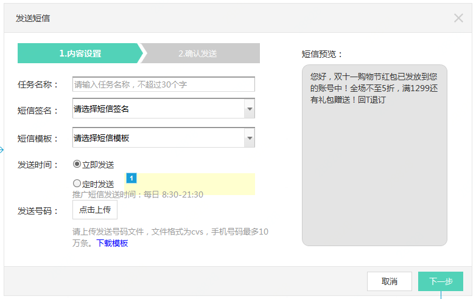
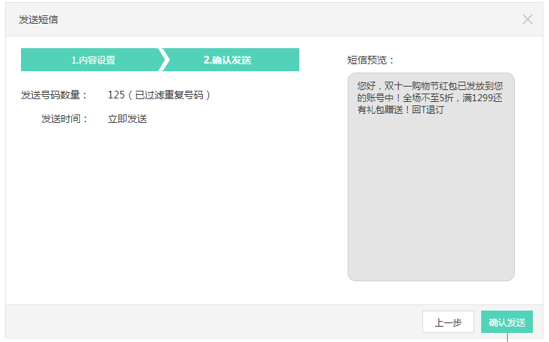

## 发送短信  

短信签名和短信模板审核通过后,就可以开始发送短信了, 在发送短信TAB页, 点选 ‘创建发送任务’, 如下图 
  

在内容设置界面中填写相关资料, 并选择已审核通过的 ‘短信签名’ 和‘短信模板’ 
 

设置发送时间并根据格式要求上传手机号后,点击下一步 
注: 推广短信发送时间: 每日 8:30 – 21:30  
  
核对发送的信息后, 点击确认发送, 完成短信任务创建 
注: 系统将自动过滤掉重复的手机号  

!