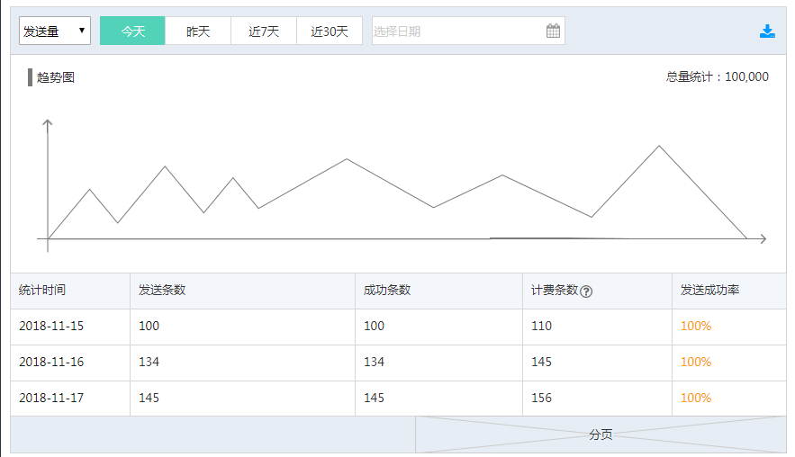
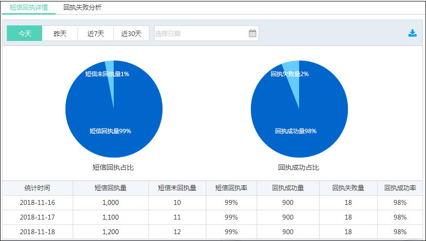

## 统计分析  

**数据总览** 
在 数据总览 项中，您可以查看今天、昨天、最近7天，最近 30 天或指定时间段的短信发送量和费用清单。  

  

**短信记录** 
在 短信记录 项中，输入手机号码，选择发送状态，单击【查询】，可以查看单个手机号在指定时间段的短信下发记录。 
  

**模板查询** 
在 模板查询 项中，输入模板 ID 后，单击【查询】，可查看指定时间内该模板的短信发送量和发送成功率。 
  

**回执分析** 
在 回执分析 项中，您可以查看今天、昨天、最近7天，最近 30 天或指定时间段的短信回执详情和回执成功率分析。 

