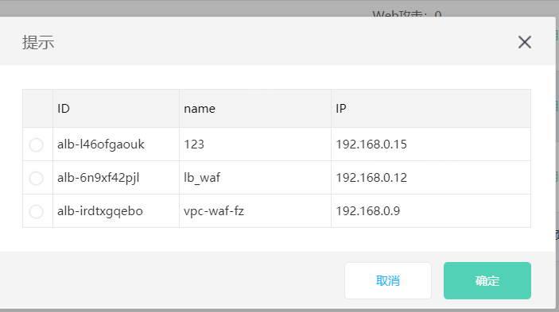

## 创建说明

应用安全网关（VPC-WAF）是基于京东云高性能负载均衡集群的Web应用安全防护产品，可创建四种套餐：体验版、基础版、高级版和旗舰版实例套餐，一个用户可创建多个套餐实例，对经过应用型负载均衡HTTP/HTTPs流量进行防护。

目前支持体验版、基础版和高级版实例创建，各个套餐版本说明，可参考[套餐说明](../Introduction/Specifications.md)。

## 创建步骤

  1、进入京东云**控制台-云安全-应用安全网关-实例管理**页面，点击创建,接入应用安全网关实例创建页面：

  2、进入**实例创建**页面，填写名称应用安全网关名称，此时如果已经有应用负载均衡，选择绑定应用负载均衡，也可以选择不绑定待创建实例成功之后进行绑定，此处选择绑定。
  

  3、确认购买时间，确认无误后，点击**立即购买**进行购买知道流程结束。

  4、返回**实例管理**页面，点击刷新，此时可以看到之前创建的应用安全网关实例。
  
   

     
  5、如果在**步骤2**中未绑定应用负载均衡，点击实例列表**操作-绑定负载均衡**选择ALB进行绑定，如果无可用的负载均衡，需要到控制台-网络-应用负载均衡页面创建负载均衡，然后在进行绑定操作。应用负载均衡详细[创建流程](https://docs.jdcloud.com/cn/application-load-balancer/create-instance)

    

  6、

  

## 相关参考
- 应用安全网关[套餐说明](../Introduction/Specifications.md)
- 应用安全网关[计费说明](../Pricing/Billing-Rules.md)
- 应用负载均衡[创建流程](https://docs.jdcloud.com/cn/application-load-balancer/create-instance)
