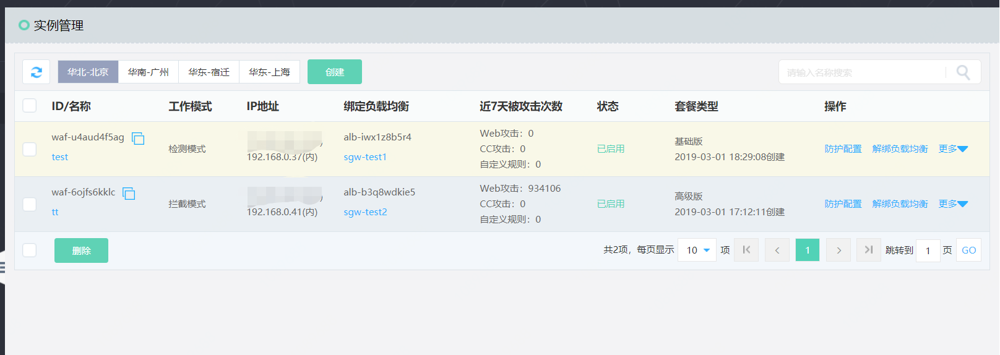
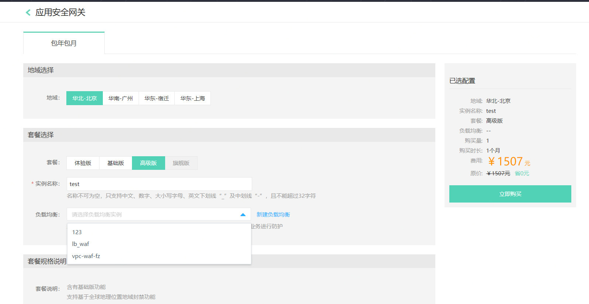
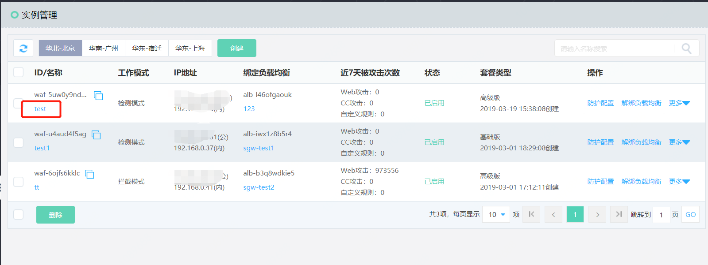
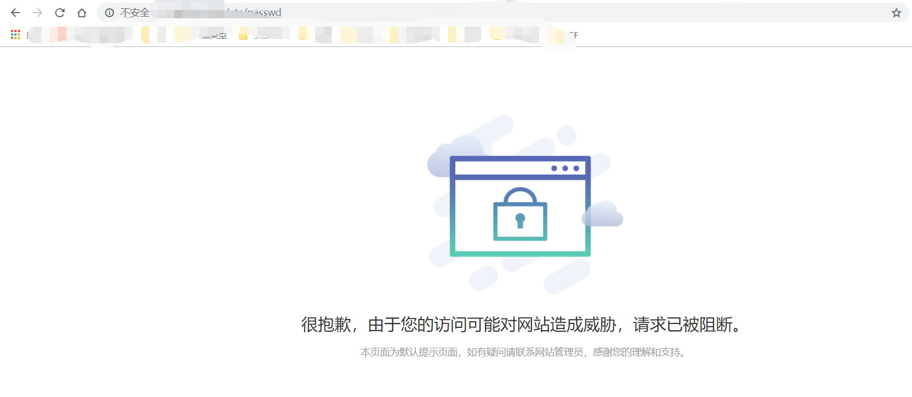

## 创建说明

应用安全网关（VPC-WAF）是基于京东云高性能负载均衡集群的Web应用安全防护产品，可创建四种实例套餐：体验版、基础版、高级版和旗舰版实例套餐，一个用户可创建多个套餐实例，对经过应用型负载均衡的HTTP/HTTPs流量进行防护。

目前支持体验版、基础版和高级版实例创建，各个套餐版本说明，可参考[套餐说明](../Introduction/Specifications.md)。

## 创建步骤

  #### 1、创建实例
  
进入京东云**控制台-云安全-应用安全网关-实例管理**页面，点击**创建**,接入应用安全网关实例创建页面：

  #### 2、绑定应用负载均衡
  
进入**实例创建**页面，填写名称应用安全网关名称，此时如果已经有可用的应用负载均衡，选择绑定即可；也可以选择不绑定待创建实例成功之后进行绑定，此处选择绑定。
  

 #### 3、订单信息确认
  
 确认购买时间，确认无误后，点击**立即购买**进行购买直到流程结束。

  #### 4、创建成功
  
 返回**实例管理**页面，点击刷新，此时可以看到在上一个步骤中创建的应用安全网关实例。
  
   

     
  #### 5、绑定/解绑/更换应用负载均衡
  
如果在**步骤2**中未绑定应用负载均衡，点击实例列表**操作-绑定负载均衡**选择ALB进行绑定；如果已绑定也可以进行解绑或者更换绑定应用负载均衡。

 
 
如果无可用的负载均衡，需要到**控制台-网络-应用负载均衡**页面创建应用负载均衡，然后在进行绑定操作。应用负载均衡详细[创建流程](https://docs.jdcloud.com/cn/application-load-balancer/create-instance)

   
 #### 6、防护模式调整
 
 应用安全网关创建成功后，默认为检测模式，实例开通后观察一段时间，确保业务正常后，点击实例列表**操作-更多-切换模式**切换WAF防护模式为：拦截模式。（体验版不支持模式调整，只支持检测模式；可通过查看首页或分析报表-Web安全报表查看是否存在异常或误报）

  
  
 ## 结果确认
 
 #### 1、攻击触发
 
 实例创建完成后，在浏览器输入对应防护的域名或者IP，在最后添加**/etc/passwd**,弹出以下页面，说明防护已经生效。
 
 
 #### 2、防护结果查看
 通过查看首页统计和分析报表页面数据，如果有数据出现说明防护已经生效。
 
 首页统计
 
 
 
 分析报表统计
 
 

## 相关参考
- [套餐说明](../Introduction/Specifications.md)
- [价格说明](../Pricing/Price-Overview.md)
- [应用负载均衡创建流程](https://docs.jdcloud.com/cn/application-load-balancer/create-instance)
