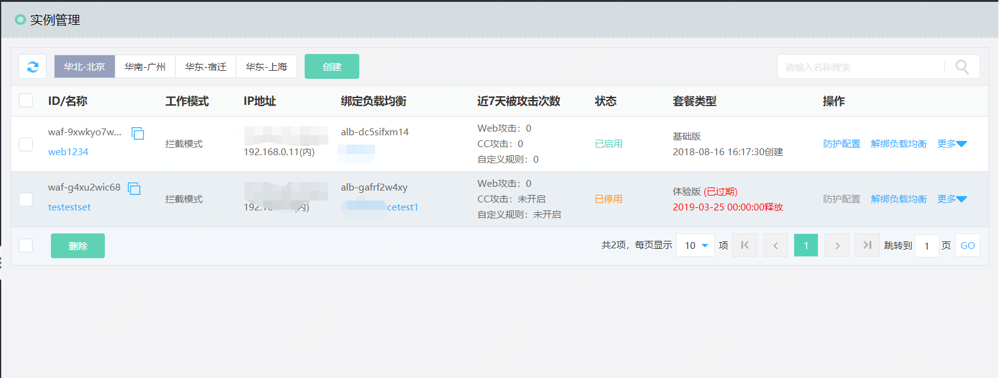
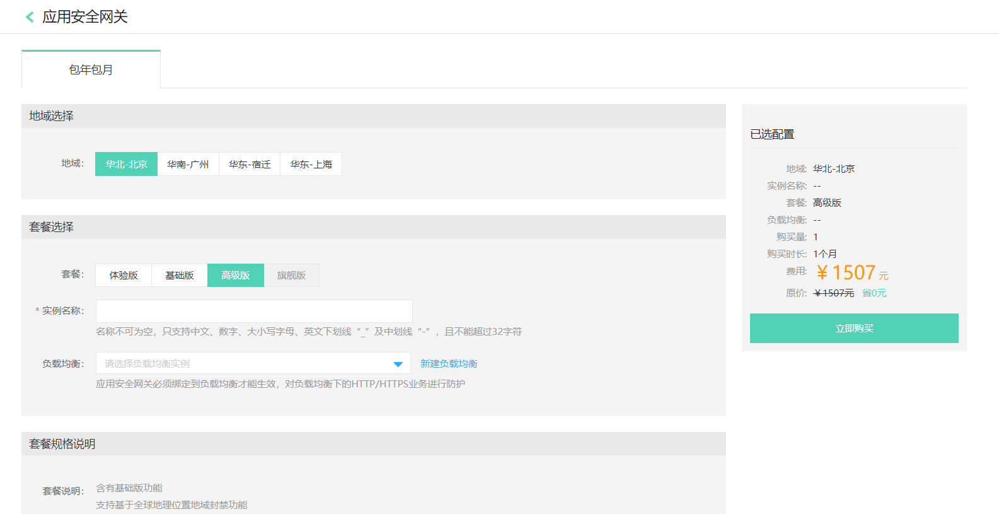
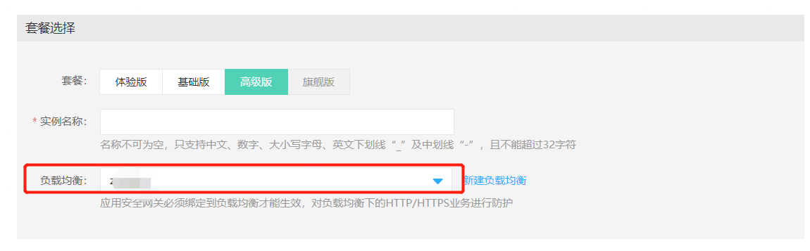

## 购买方式说明

**1、官网购买**

进入京东云官网，选择产品-云安全-应用安全网关，点击立即使用进行购买。

**2、控制台购买**

进入控制台-云安全-应用安全网关-实例管理页面，点击创建进行购买。

进入套餐选择页面，根据业务类型不同选择不同套餐。

选择绑定负载均衡，应用安全网关通过绑定应用负载均衡（ALB），对所有经过的应用负载均衡HTTP/HTTPs(含Websocket)流量进行Web安全防护。（也可以创建应用安全网关实例成功之后，再进行负载均衡绑定）

点击下一步，直到完成，点击刷新页面即可看到已经购买的VPC-WAF实例。
