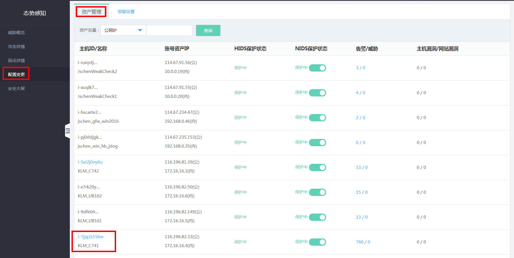
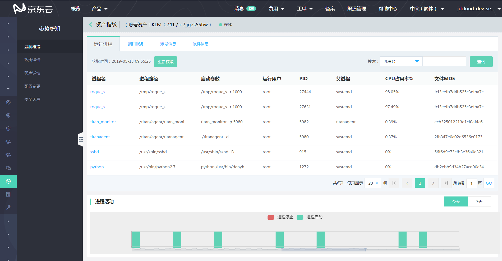
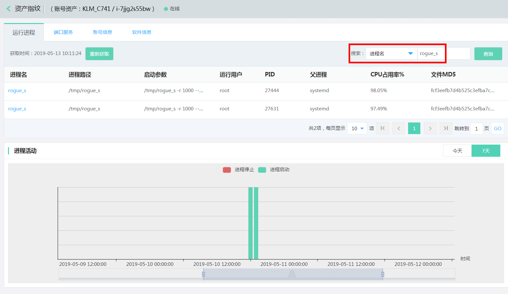
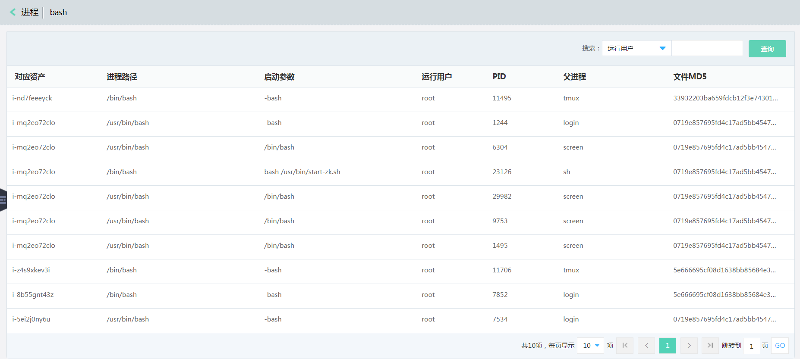
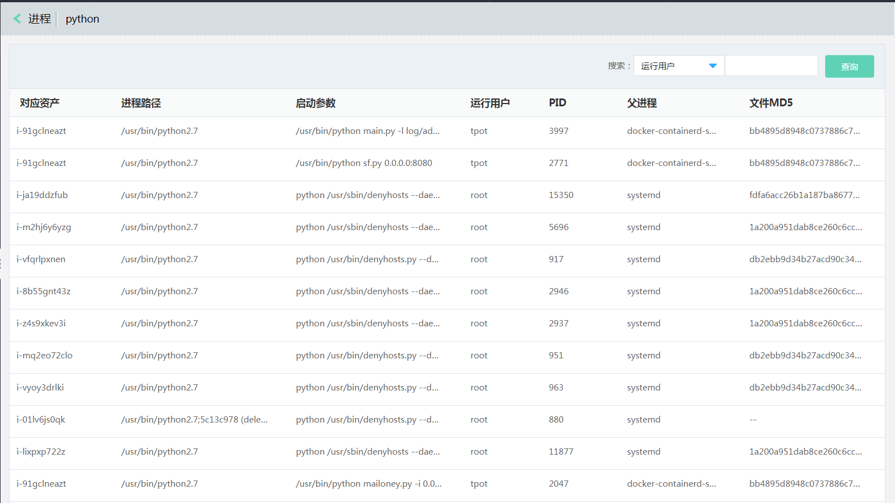
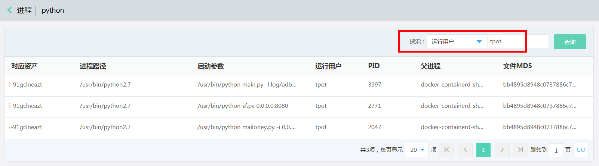

# 资产指纹

### 资产指纹

#### 功能说明
态势感知资产指纹功能定期收集并记录服务器上的以下信息：运行进程、端口服务、账号信息、软件信息，帮助您全面了解资产的运行状态,便于入侵排查。

- 查看单个资产指纹

登录【态势感知】->【配置变更】->【资产管理】，点击具体资产信息。

- 查询指定资产指纹历史变更

登录【态势感知】->【配置变更】->【资产管理】，输入需要查询的进程，查询历史变更情况。

- 查看全部资产指纹

登录【态势感知】->【配置变更】->【资产管理】，点击具体资产信息，点击进程、进入聚合数据界面。

- 查询指定资产指纹聚合结果

登录【态势感知】->【配置变更】->【资产管理】，点击具体资产信息，点击进程、进入聚合数据界面，输入需要查询的进程。

