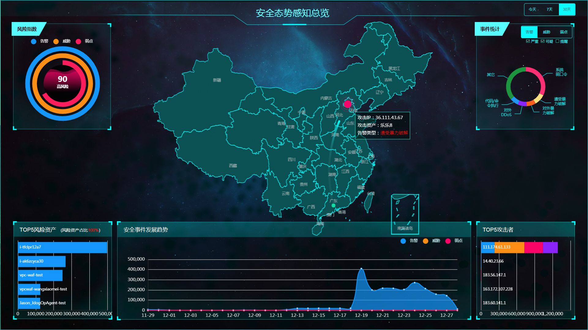
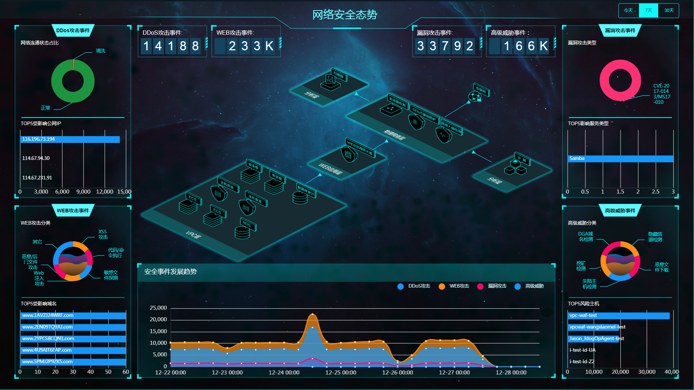
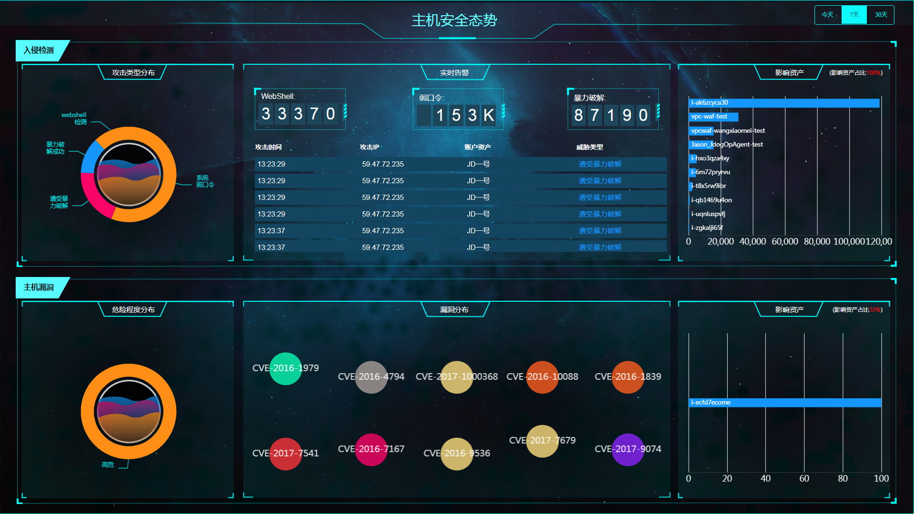

# 安全大屏

### 功能模块定义

安全大屏，主要是帮助安全运营人员做安全运营决策，本企业领导或者行业用户参观视察以及给用户展示全局安全态势等需求因运而生。现阶段安全大屏包含：态势感知总览、网络安全态势
、主机安全态势

#### 态势感知总览

态势感知总览大屏主要是从全局的角度告诉安全团队发生了什么安全问题，安全团队需要做什么以及做的怎么样。

态势感知总览大屏包含：安全指标、攻击炮图、Top5风险资产、Top5攻击者、安全事件发展趋势、事件统计（告警/威胁/弱点类别分布）、统计状态配置（状态时间|告警级别设置）

安全指标：通过对本账号名下所有云主机的告警、威胁、弱点数量统计，计算出风险值，从而得出安全评级（高/中等/低风险），低风险<=40，中等风险40<x<=70，高风险70<x<=100

攻击炮图：可视化显示攻击源、攻击目的、攻击类型，让安全运营人员对攻击有感性的认识。攻击显示【攻击IP|风险资产|告警类别】

Top5风险资产：让用户了解最容易遭受攻击的资产，知道运营人员重点关注这些资产和发生的攻击，尽快按照安全建议整改。同时提供影响资产占比。

Top5攻击者：让用户关注Top攻击者，可以通过ACL、安全组、云WAF等阻断这些IP高危的访问，完成安全响应。攻击者计算方式：首先以IP维度统计。分别从4个方面统计：

 * 入侵探测（主机扫描、应用扫描、应用漏洞攻击、	遭受暴力破解）
 * Web攻击（Web注入攻击、XSS攻击、代码/命令执行、	文件包含攻击、恶意/后门文件攻击、越权访问、敏感文件探测）
 * 肉鸡行为（对外DDoS、对外暴力破解、对外可疑连接、	恶意软件行为、暴力破解成功、Webshell检测）
 * 高级威胁（失陷主机检测、DGA域名检测、恶意文件下载、隐藏信道检测、挖矿检测、HTTP异常检测）

安全事件发展趋势：让用户了解告警、威胁、弱点的发展趋势，从宏观的角度上对云上业务做出安全策略规划。

事件统计：根据不同安全等级给出告警、威胁、弱点的安全事件分布

#### 网络安全态势

网络安全态势大屏主要是从网络层面告诉安全团队发生了什么安全问题，安全团队需要做什么以及做的怎么样。

网络安全态势大屏包含：DDoS告警事件、Web攻击事件、漏洞攻击事件以及高级威胁事件4个方面统计。同时配合网络安全检测引擎图，以及网络安全事件发展趋势。

 * DDoS告警事件包含：网络连通状态占比（正常、黑洞和清洗的时长占比）、Top5受影响公网IP。
 * Web攻击事件包含：Web攻击类别分布、Top5受影响域名。
 * 漏洞攻击事件：漏洞攻击类型、Top5受影响服务类型。
 * 高级威胁事件：高级威胁分类、Top5风险主机。 

#### 主机安全态势

主机安全态势大屏主要是从主机层面告诉安全团队发生了什么安全问题，安全团队需要做什么以及做的怎么样。

主机安全态势大屏包含：主机入侵检测事件和主机漏洞两个方面描述主机上的安全。

 * 主机入侵检测事件包含：攻击类型分布、实时告警、影响资产和影响资产占比。
 * 主机漏洞：危险程度分布、漏洞分布、影响资产和影响资产占比。 
 

