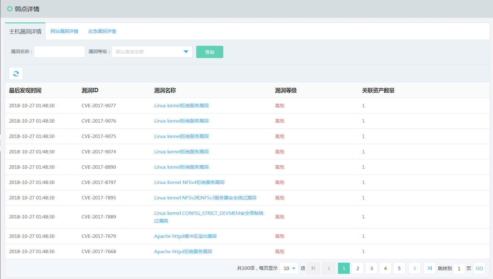
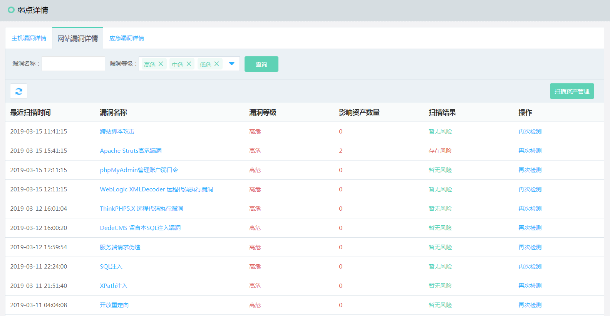
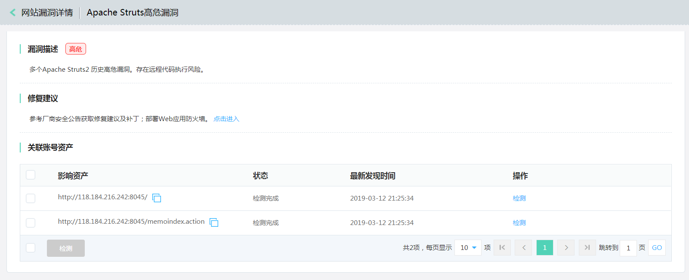
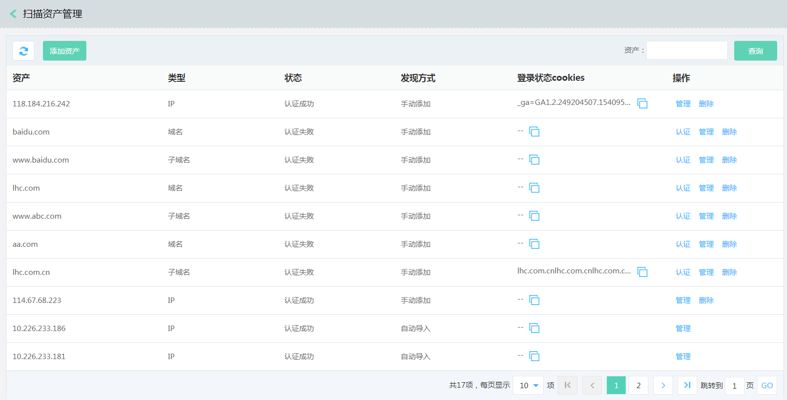
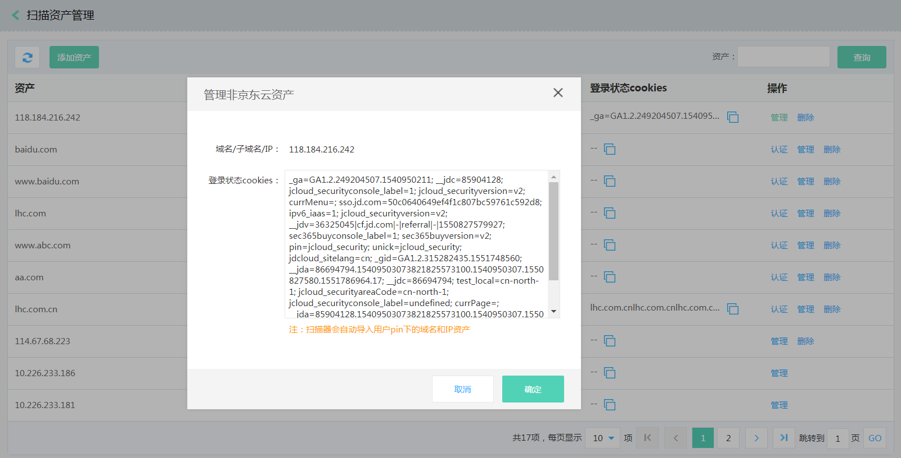
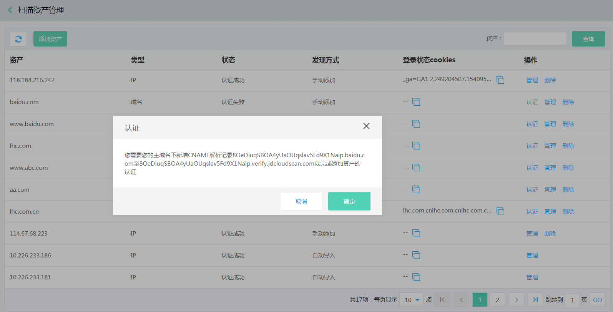
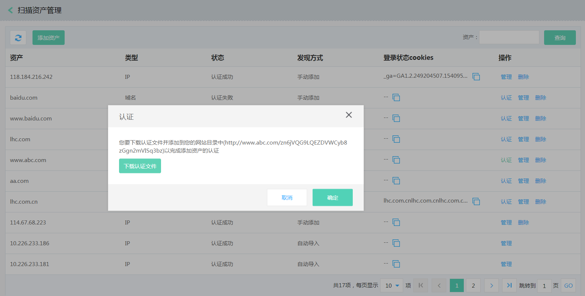
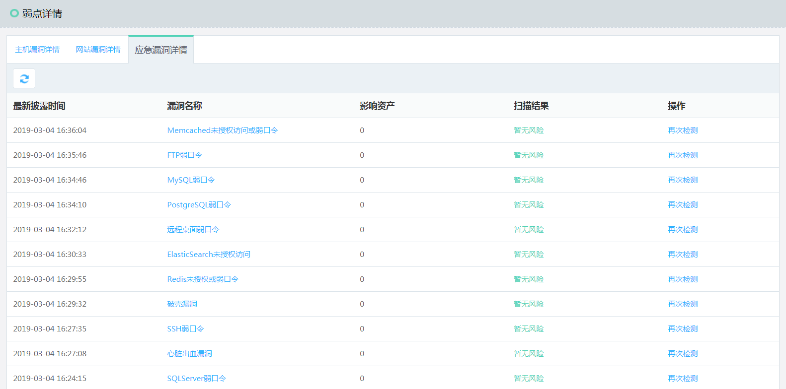
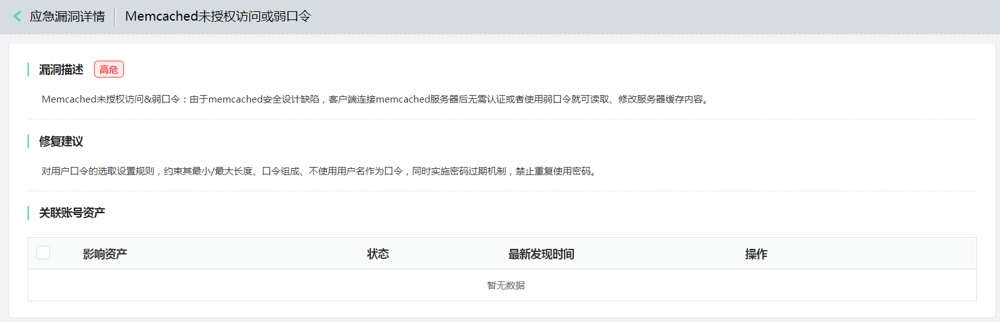

# 弱点详情

### 主机漏洞事件

#### 界面

  
  

#### 功能说明
目前提供基于主机漏洞详情，以漏洞为统计维度向用户展示主机弱点。督促用户修复相关漏洞。

- 操作步骤
点击漏洞名称跳转到【漏洞详情页】以及关联的账号资产。
点击多选框，可以批量修复。
Windows系统可以点击修复操作，Linux给出修复建议，用户自行修复。

### 网站漏洞事件

#### 界面

  
  
  
  
  
   
  
#### 功能说明
网站漏洞模块结合白帽渗透测试实战经验，通过先进的爬虫，分布式技术对京东云提供全面网站威胁检测服务。帮助用户缩短云资产漏洞发现时间，及时修复漏洞，一定程度上缓解了黑客入侵行动的进一步发生，同时避免遭受品牌形象和经济损失。

- 操作步骤
在网站漏洞列表页，点击具体的漏洞名称，进入到【漏洞详情页】。点击【检测】或者【再次检测】启动手工检测流程,观察检测结果。点击【扫描资产管理】，进入到扫描资产管理页，本账号下的公网IP，绑定在京东云域名系统中的域名资源会自动导入到扫描器中，同时系统提供非京东云资产域名和子域名的导入，但需要认证确保网站所有权。点击【认证】，域名通过cname的方式，子域名通过上传认证文件方式处理。网站漏洞模块还提供了登录账号扫描，点击【管理】，填写cookies，实现其功能。

### 应急漏洞事件

#### 界面

  
  

#### 功能说明
当有紧急漏洞发生时，京东云安全运营团队会提供应急漏洞验证POC，帮助用户快速检查服务器的健康状态，缩短云资产漏洞发现时间，及时修复漏洞。

- 操作步骤
在应急漏洞列表页，点击具体的漏洞名称，进入到单漏洞详情页。通过搜索功能，找到需要检测的资产，点击【检测】或者【再次检测】，会启动手工检测流程。观察检测结果。
