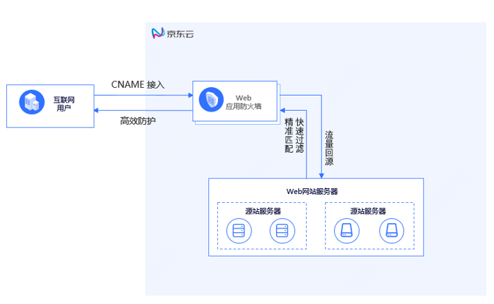

## 什么是web应用防火墙？

Web应用防火墙(Web Application Firewall)是京东云推出对网站或APP服务进行安全和合规性保护的应用安全防护产品；通过恶意特征提取和大数据行为分析识别恶意流量并处理，提高Web站点的安全性和可靠性，保护网站核心业务和数据安全。

京东云同时提供[应用安全网关](https://docs.jdcloud.com/cn/application-security-gateway/product-overview)(VPC-WAF)和[Web应用防火墙](https://www.jdcloud.com/cn/products/web-application-firewall)（云WAF）两种WAF产品形态，满足不同客户需求，提供多样化的Web安全解决方案。

京东云Web应用防火墙的逻辑部署示意图如下：

