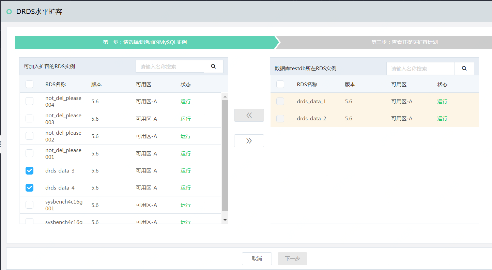
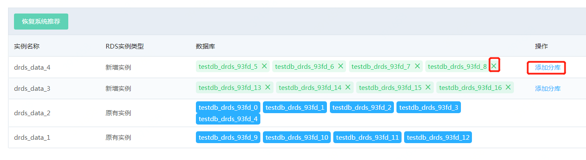
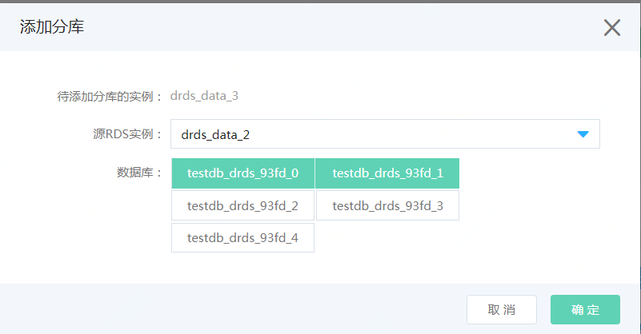

# 数据库水平扩容

**1. 操作入口**

- 在数据库列表中，点击要数据库右变的哦【 **水平扩容** 】连接

- 或者在数据库的详情页面中，点击【 **水平扩容** 】按钮

**2. 添加新RDS实例**

从左边的RDS MySQL实例中选择新增的实例。系统会根据新加入的实例的数目和规格，生成扩容计划。 当实例较多时，生成扩容计划的需要若干秒，请耐心等待一会。
如果扩容计划生成失败，请查看[FAQ](https://docs.jdcloud.com/cn/drds/faq)

**注意：为了系统稳定性，该数据库所在的RDS MySQL的版本必须一致**

**3. 查看扩容计划**

系统会生成推荐的扩容计划，显示扩容后的数据库分布情况，如下图所示。

**4. 调整扩容计划**

用户可以根据实际业务规格，调整扩容计划，

- 点击“新增实例”中数据库右上方的 **"X"** 号，可以从该实例的扩容计划中移除该数据库。 被移除的该数据库会回到它原先所在实例中。

-  点击“新增实例”一行中右表的 **“添加分库”** 连接，可将其他原实例上的分库加入到该实例中。

**5. 执行扩容计划**

调整完成后，点击【 **确认** 】，开始执行扩容计划。 扩容的执行情况在 **“扩容任务”** 页面中查看
