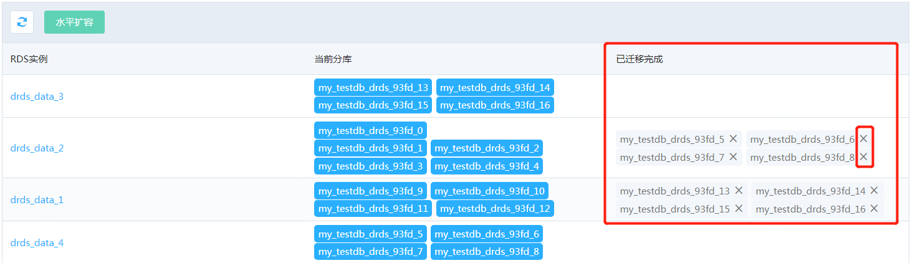

# 检查并清除迁移完成的旧库

水平扩容完成后，原先RDS MySQL上的一部分分库已经迁移到新的RDS MySQL 上了，但这部分已经 **迁移完成的分库系统不会自动删除，
建议用户对分库的数据检查校验完成后，手工删除** 

用户可以直接在DRDS的数据库详情页面中 **“已迁移完成”** 一列中查看那些分库已经迁移完成。

点击已迁移完成分库右上方的 “X” 图标可在后端的RDS MySQL上删除该分库。

