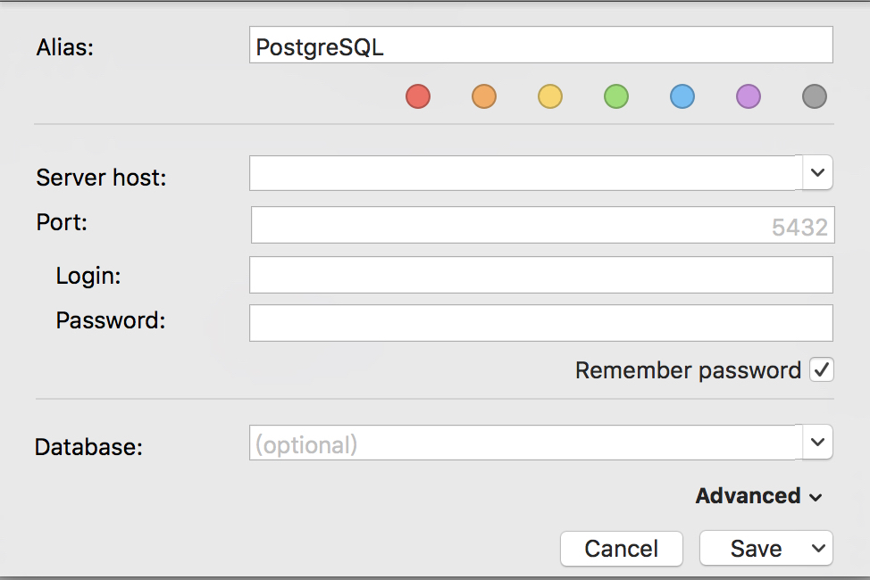

# 连接 PostgreSQL 实例
如果您购买了云数据库 PostgreSQL 实例，可以通过京东云云主机内网连接实例，也支持本地客户端通过外网访问域名远程连接实例，不过通过外网访问域名远程连接实例的时候，请提前做好访问权限控制，保证数据库的安全性。

## 通过京东云主机连接数据库
在京东云主机安装 PostgreSQL 客户端后，可进入命令行方式连接数据库。

1. 命令格式：mysql -h 域名 -p 端口 -U 用户名-d 库名 。
2. 域名：要访问的云数据库 PostgreSQL 的域名，域名展示在实例的详情页面。
3. 端口：链接端口号默认为 5432。
4. 用户名：在账号管理中创建的用户名。
5. 库名：需要访问的数据库的库名。

## 通过本地数据库管理软件连接实例
如果需要本地的数据库管理软件连接云数据库 PostgreSQL，默认云数据库 PostgreSQL 不支持外网访问，需要手动开启，具体操作请参见 [开启外网访问](../../Operation-Guide/Instance/Internet-Access.md)。
我们以 SQLPro for Postgres 软件为例，介绍下如何连接云数据库 PostgreSQL 

### 操作步骤
1. 打开本地的数据库管理软件，具体参数说明如下：
    * Server Host：填写云数据库 PostgreSQL 的外网访问域名。
    * Port：默认就是 5432，不需要做任何改动。
    * Login：填写云数据库 PostgreSQL 的账号名。
    * Password：填写云数据库 PostgreSQL 的账号名对应的密码。
    * Database: 选填项，指需要访问的数据库的库名

    

2.点击 ***Save and Connect*** 按钮，就可以连接到云数据库实例了。 
