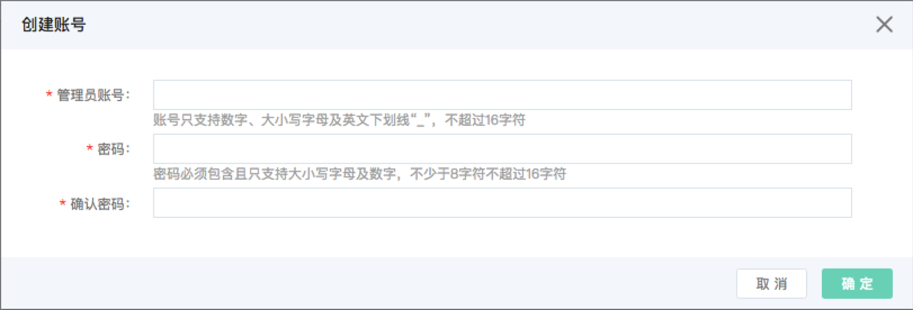

# PostgreSQL 创建账号
在使用数据库之前，您需要在云数据库 PostgreSQL 实例中创建账号。

## 注意事项
* 云数据库 PostgreSQL 通过控制台只能创建一个账号，此账号拥有管理员权限。
* 账号创建完后，账号名不允许修改。 

## 操作步骤 
1. 登录 [云数据库 RDS 控制台](https://rds-console.jdcloud.com/database)。
2. 选择需要创建账号的目标实例，点击目标实例，进入实例详情页。
3. 选择 ***账号管理*** 标签，打开账号管理页面，点击 ***创建账号*** 按钮，创建账号弹出框参数说明如下:
    * 管理员账号：账号我们保留了一些关键字名称，请参考 [限制说明](../../../Introduction/Restrictions/PostgreSQL-Restrictions.md)，并且账号的长度和字符有一定限制，具体以控制台为准。
    * 密码：密码的长度和字符有一定限制，具体以控制台为准。

    

4. 单击 ***确定*** 按钮，创建账号成功，返回到账号管理页面。
