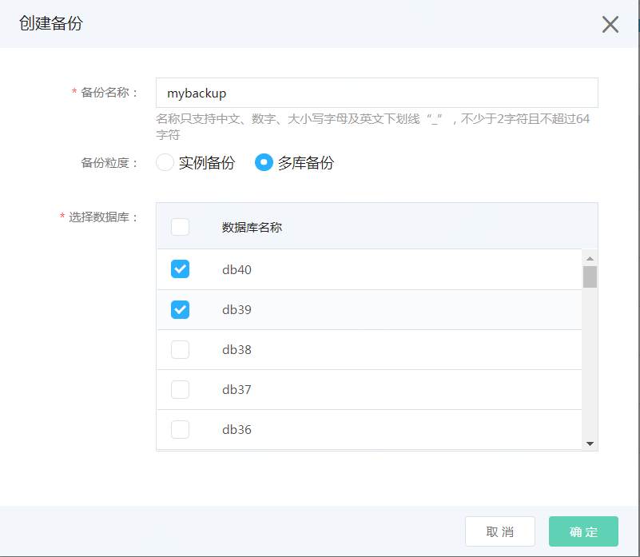

# 创建备份
云数据库 SQL Server 实例支持自动备份和手动备份两种方式；您可以通过修改备份策略来设置自动备份触发的时间点，具体操作请参考 [备份策略](../Backup-Policy/SQLServer-Backup-Policy.md)。

实例的备份会存放在京东云的云存储服务上，目前京东云暂不收取备份所产生的空间占用费用。

1. 点击实例名，进入实例页面，选择【备份管理】页面，点击【创建备份】，并输入备份名称
2.选择备份粒度
- 实例备份：表示备份整个实例。选择后点击“确认”开始备份。
- 多库备份：表示备份一个或多个数据库。控制台会列出当前可选择的数据库（只有处于"运行"状态的数据库才会显示在列表中），选择要备份的数据库，并点击确认开始备份。

## 3. 备份完成
返回备份列表页能看到备份显示“创建中”
等待一段时间后，点击刷新按钮，手工刷新页面，可以看到备份完成，显示备份“正常”

