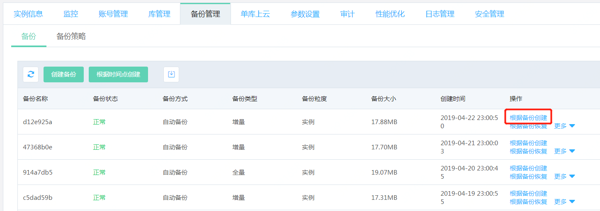

# SQL Server 根据备份创建
SQL Server可以根据实例的备份在同一个地域中创建一个新实例。

## 最佳实践
当实例发生问题需要恢复时，我们建议优先使用 **“根据备份创建”** 或者 **“根据时间点创建”** 的方式，新创建一个实例，然后进行数据校验，确认恢复的数据正确无误。 数据校验正确无误后，再使用 [**域名切换**](../../Instance/Exchanged-DNS.md) 的功能，将原有实例的域名切换到新创建的实例上。

> **注意：**
>根据备份创建所使用的备份必须满足以下条件，否则操作将会失败
>1. 备份为实例级备份，单库级的备份不能使用“根据备份创建”
>2. 备份可以是全量备份，也可以是增量备份，但增量备份所依赖的全量备份必须存在（该全量备份在备份列表中可见）
>3. 建议新建实例的存储空间大于或等于原实例的存储空间

## 1. 操作入口
进入实例详情中的备份管理页面，在所选备份的右边点击 **“根据备份创建”**

## 2. 输入新创建实例的相关信息
在弹出的页面中可看到选择的备份名称，备份创建时间及地域信息。

选择新创建实例的规格，VPC可用区及实例名称等信息，具体步骤可参考[创建实例](https://docs.jdcloud.com/cn/rds/create-instance)
