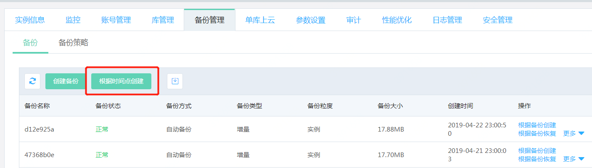
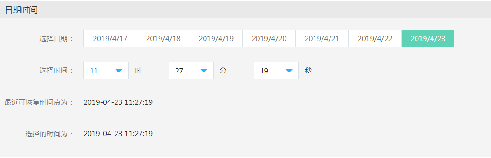

# SQL Server 根据时间点创建

SQL Server可以根据备份在相同地域中新创建一个实例，实例中的数据可以恢复到7天（默认）中的指定时刻。

## 最佳实践
当实例发生问题需要恢复时，我们建议优先使用 **“根据备份创建”** 或者 **“根据时间点创建”** 的方式，新创建一个实例，然后进行数据校验，确认恢复的数据正确无误。 数据校验正确无误后，再使用 [**域名切换**](../../Instance/Exchanged-DNS.md) 的功能，将原有实例的域名切换到新创建的实例上。

## 1. 操作入口
进入实例详情中的备份管理页面，点击 **“根据备份创建”**

## 2. 选择要恢复的时间
选择新建实例中的数据将要恢复到的时间点

## 3. 输入新创建实例的相关信息
选择新创建实例的规格，VPC可用区及实例名称等信息，具体步骤可参考[创建实例](https://docs.jdcloud.com/cn/rds/create-instance)
