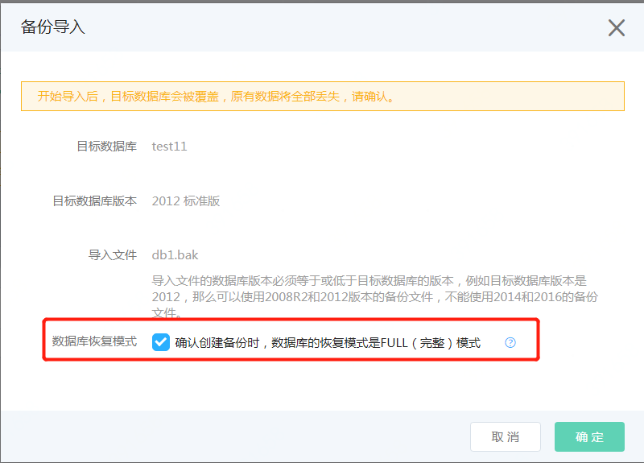

# 导入备份文件
## 1.操作入口
- 进入到页面中能看到导入的文件。 如果未看到，请点击刷新按钮。
- 点击要上传文件右边的导入按钮，开始导入操作

## 2. 选择要导入的数据库
- 只有状态为“运行”的数据库才显示在列表中。
- 如果刚创建的新库状态还是“创建中”，稍等一会，等创建完成后，就会显示在数据库列表中了。

## 3. 确认导入
- 查看操作的信息无误。 
注意： 单库上云的备份仅支持FULL模式的备份，因此请确认备份方式是否正确，具体的方法可以查看[文档](https://docs.jdcloud.com/cn/rds/backup-local-database)
- 确认信息无误后，勾选选择框，并开始导入

         
## 4. 查看导入状态
- 点击一下刷新按钮，能看到文件的导入状态为“导入中”，同时实例的状态也变更为“单库备份恢复中” 
- 查看数据库的状态，能看到数据库的状态会按照如下的顺序变化：“删除中”-->“创建中" --> "运行”。

