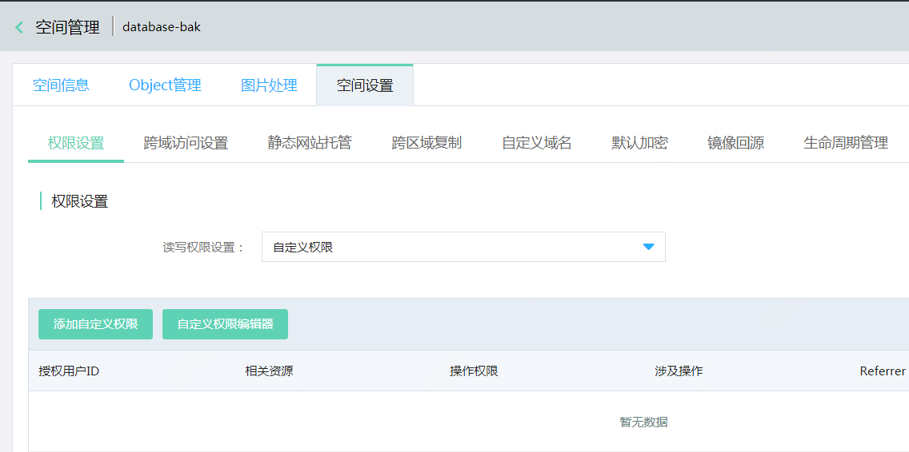
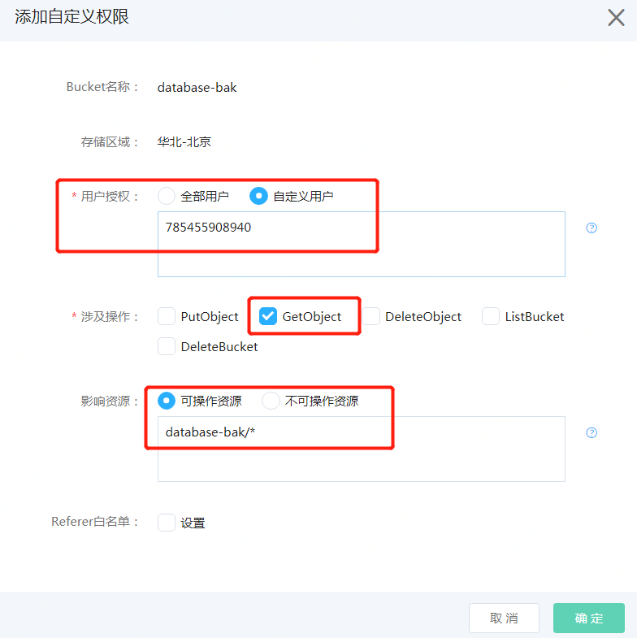

# 备份文件授权

SQL Server实例需要有对象存储中的备份文件的读取权限，可以按照以下的方法添加文件读取权限

**建议： 我们建议创建单独的对象存储空间用于上传要导入的备份文件，并给后台系统账号授予整个Bucket的读取权限**

1. 创建用于存放要导入文件的空间，例如database-bak
2. 进入权限设置页面
点击进入该空间，选择 **“空间设置”** ， **【添加自定义权限】** ，进入权限设置页面

3. 设置权限
- 选择 **“自定义用户”** ，添加用户ID： **785455908940**
- 涉及操作勾选 **“GetObject”**
- 其他保持不变
- 点击 **【确认】** 保持设置

**注意：不要对该Bucket中“空间设置”下的“静态网站托管”页面中的任何参数进行设置，否则可能会导致备份文件读取失败**
