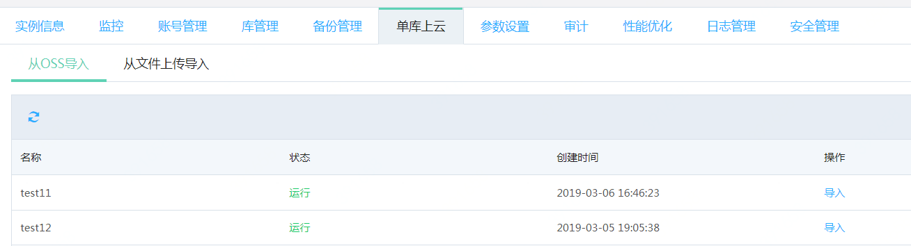
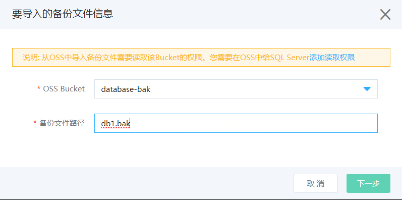
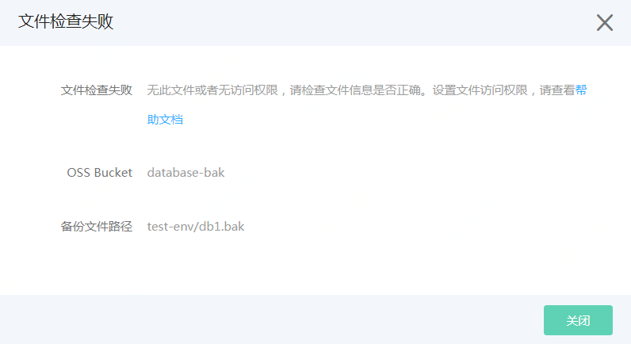
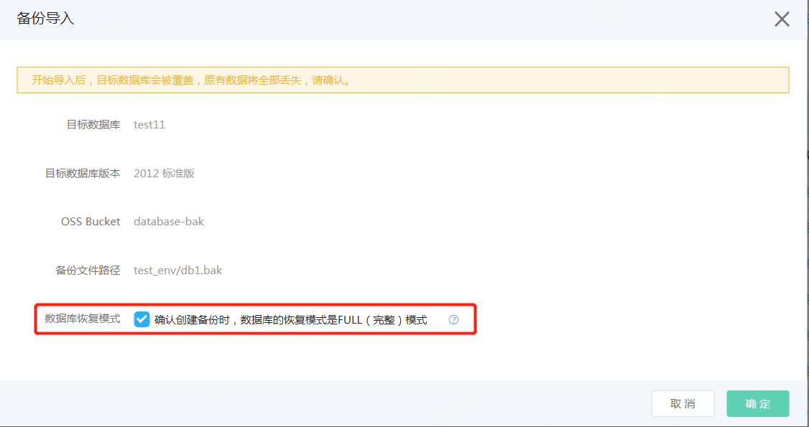

# 备份导入

1. 进入导入页面
- 在实例详情中，点击“单库上云”页面，选择“从OSS导入”页面
- 在需要导入的数据库后点击导入

2. 输入导入信息

选择对象存储的Bucket（空间）并输入导入的备份文件在Bucket中的路径。 例如备份文件存放在对象存储的Bdatabae-bak这个Bucket 中，在Bucket中的中路径为test-env/db1.bak, 则界面选择Bucket **database-bak** , 路径输入 **test_env/db1.bak**

如果文件不存在或者没有足够的权限，会提示错误信息。需要检查文件路径是否正确，Bucket或文件的权限是否正确授予了。权限设置可查看[文档](https://docs.jdcloud.com/cn/rds/grant-file-privilege-v2)

3.  确认信息并开始导入
- 查看操作的信息无误。 
注意： 单库上云的备份仅支持FULL模式的备份，因此请确认备份方式是否正确，具体的方法可以查看[文档](https://docs.jdcloud.com/cn/rds/backup-local-database-v2)
- 确认信息无误后，勾选选择框，并开始导入

4. 查看导入状态
- 稍等片刻，可实例的状态变更为“单库备份恢复中” 
- 数据库的状态会按照如下的顺序变化：“删除中”-->“创建中" --> "运行”。
