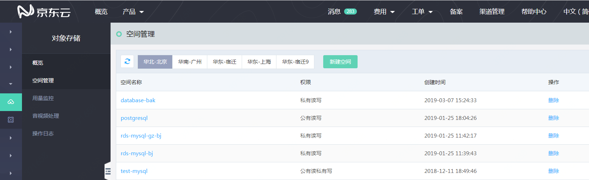
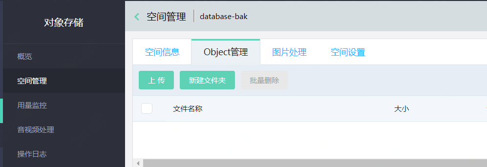
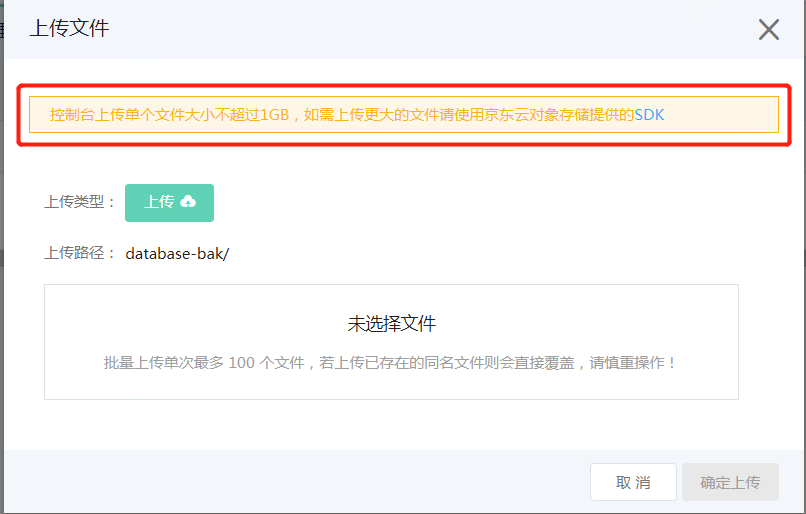

# 上传备份到OSS

1. 对象存储的空间管理页面
进入控制台中的 **“对象存储”** ，点击 **“空间管理”**

2. 选择对象存储空间
点击空间名称，进入要上传文件的空间

3. 上传文件
选择 **“Object管理”** 页面，根据需要点击 **【上传】** 或者 **【新建文件夹】**

**注意：控制台上传单个文件大小不超过1GB，如需上传更大的文件请使用京东云对象存储提供的 [SDK](https://docs.jdcloud.com/cn/object-storage-service/multipart-upload-s3)**

