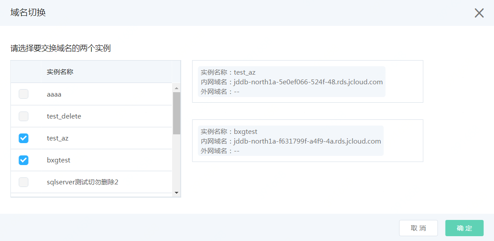

# 域名切换

域名切换是同时交换两个实例的内网和外网域名。 当用户使用根据备份创建和根据时间点创建后，如果应用需要连接新实例，可通过域名切换的功能，将原有老实例的域名切换到新实例上。 这样可以避免修改数据库连接字符串带来的额外风险和工作。

 例如用户误删除了一批数据，需要使用备份恢复，但又想保留原实例，用于数据校验，这这时用户可进行如下操作：
1. 使用 **"根据备份创建"** 或 **"通过时间点创建"** 将数据恢复到新实例。
2. 验证新实例上的数据
3. 使用 **“域名切换”** 的功能，将原实例的域名切换到恢复后的新实例上，可避免应用调整数据库的访问域名。

## 操作步骤
**1. 点击“域名切换”**

进入实例详情页面，点击右上方的“域名切换”

**2. 选择实例**

选择要交换域名的两个实例后，点击【确认】进行操作

**注意：两个实例必须同时有或者没有外网域名。 如果两个实例一个有外网域名，一个没有，将不允许操作。**

