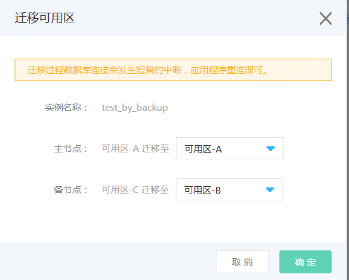

# 迁移可用区
可以修改RDS 实例的可用区，例如将原先主备均位于可用区A的RDS实例修改为主备分别位于可用区A和可用区B。

迁移用户可正常连接到数据库实例，并读写数据。 迁移完成后，有一个短暂的闪断，应用只需重连即可。

> **备注：暂时仅支持 SQL Server**

**1. 操作入口**
- 实例列表页：实例右边【更多】 --> 【迁移可用区】
- 实例详情页：【实例信息】页面中 “基本信息”中的【迁移可用区】
- 实例详情页：右上角 【操作】 --> 【迁移可用区】

**2. 选择新可用区**

选择实例主备节点的新可用区

**3. 在对话框中检查信息无误后，再次确认**

**4. 实例状态**

可用区更改过程中，实例状态变更为“迁移可用区中”，期间用户可正常连接到数据库实例，并读写数据。 迁移完成后，有一个短暂的闪断，应用只需重连即可。
