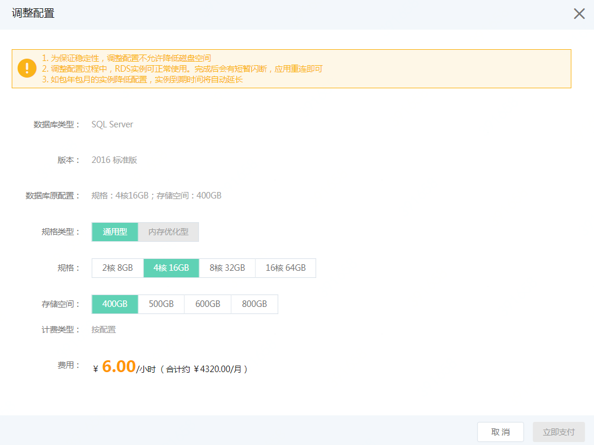

# 调整配置

RDS 实例可根据用户的需求，动态调整实例的CPU，内存及磁盘大小。 配置调整过程中，RDS 实例可正常使用，调整完成后，会有一个的闪断，应用重连即可。

- MySQL、Percona、MariaDB
  - 仅支持扩容，不支持缩容。
  - 仅支持扩容主实例，暂不支持扩容只读实例
  
- SQL Server
  - 同时支持扩容和缩容
  - 为保证系统的稳定性，调整后的磁盘大小只能大于或等于原磁盘大小
  
## 操作步骤
1. 入口有两个，分别为
    * 列表页：选择需要目标实例，点击 操作 这一列的 更多 -> 升级配置/调整配置
    * 实例详情页：进入到实例详情页，点击页面右上角的 操作 -> 升级配置/调整配置
2. 选择调整后的配置，点击 【确认】进行调整
    

