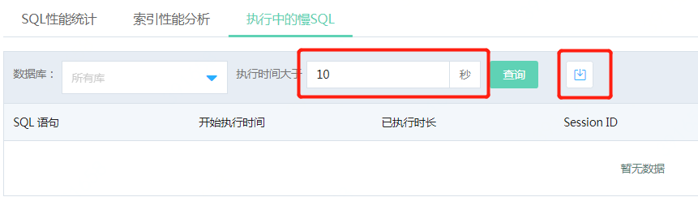

# 执行中的慢SQL
根据用户定义的条件，筛选出 **正在执行中** 的慢SQL（即执行时长大于一定时间的SQL），是用户能够专注对这部分SQL进行优化。

**注意：由于性能统计数据仅保存在内存中，因此系统仅保留上次重启以来的相关性能信息。如需历史数据，建议定期在控制台或通过OpenAPI导出下载。**

## 1. 自定义慢SQL条件
可定义慢SQL的条件，例如筛选出执行时间大于等于10秒的SQL

## 2. 导出统计结果
可将统计结果导出为excel格式的文件，便于保存和发送给相关人员进行分析、优化

