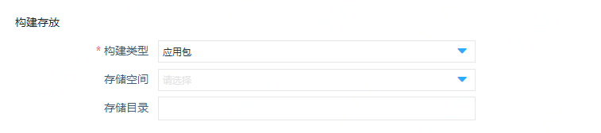
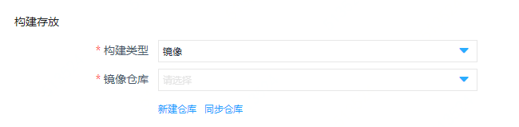

# 新建项目

进入云编译界面后，单击项目列表页面中【新建项目】按钮，新建编译任务。

1、在新建项目页面，依次填写项目名称（必填）

2、编译镜像：选择编译环境，支持Java、golang、node、static_resource等主流编译语言环境；支持用户自定义编译镜像。
 

3、源提供商：支持京东云代码托管、GitHub私有/公有仓库及其他git公有仓库

4、仓库地址：远程仓库的URL地址,与 git clone 命令的地址相同

5、代码分支：填写您要选择的代码分支

6、构建规范：根据模板生成构建命令，参看如下

	```
      ---
      # 设置需要的环境变量，不需要可以不写
      #envs:
      #  - name: 'name1' 这里是环境变量的名称
      #    value: 'value1' 这里是环境变量的值
      #  - name: 'name2' 用列表的方式来了设置多个值
      #    value: 'value2'

      # 设置编译的命令, 同环境变量的设置方式
      # 如:
      #cmds: 
      #  - name: 'do make'  步骤名称
      #    cmd: 'make' 真实的命令,如果不在PATH中，需要写全路径
      #  - name: 'do install'
      #    cmd: 'make install'
      cmds:
        - name: 'list current dir'
          cmd: 'ls'
        - name: 'make output dir'
          cmd: 'mkdir -p output'
        - name: 'touch some files'
          cmd: 'touch a b c'
        - name: 'copy to output dir'
          cmd: 'cp a b c output'

      # 抽包路径, 这个是必选项
      out_dir: 'output'
	```
7、构建类型：应用包\镜像
 
  * 当选择 构建类型为 应用包 时，需要提供构建产出物存放oss地址。
  
   
   
   存储空间：用户在编译任务所在区域对象存储bucket
  
   存储目录：指定bucket下的目录
  
  * 当选择 构建类型为 镜像 时，需要提供镜像仓库地址。
 
   
   
   镜像仓库：选择编译任务所在区域下的 容器镜像仓库。如没有创建相应的注册表及镜像仓库，通过 新建仓库 链接，跳转到容器镜像仓库页面。

8、显示高级设置：

超时：指定 30 到 120 分钟 (2个小时) 之间的一个值，超过此时间未构建完成置为失败。默认值30分钟。

计算类型：目前提供1c1g, 2c2g, 4c4g

通知频率：设置通知频率为 构建异常发送 每次构建都发送

点击 保存/保存并构建 完成项目创建/立即构建。
