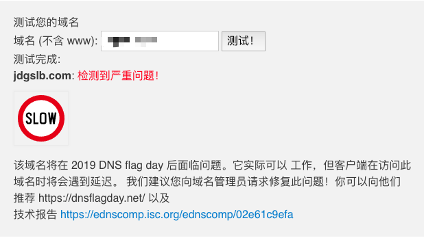
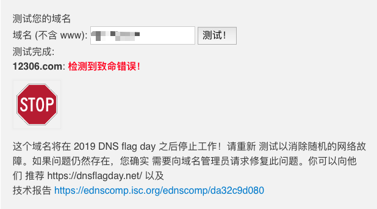

## 关于 DNS Flag Day 的说明

### 什么是 DNS Flag Day？

 [DNS Flag Day](https://dnsflagday.net/)是一项针对权威DNS的、共识性的全球更新，旨在确保所有主要DNS基础架构都遵循新的EDNS标准（DNS扩展机制）。
 从2019年2月1日起，对于不支持EDNS协议的权威DNS服务器，可能会被Google、Cloudflare、Cisco/OpenDNS、ISC/BIND等公共DNS、递归DNS标记为服务不可用，从而导致域名无法正常解析。
 
### 京东云对DNS Flag Day的支持情况

1. 2月1日起，京东云解析DNS服务将实现完全符合DNS规范，支持EDNS扩展
2. 2月1日起，使用京东云解析DNS服务的域名，在全球任何地区均能正常解析，不受任何影响 
 
### 如何测试
托管在京东云解析DNS的域名，可以使用测试网站[https://dnsflagday.net/index-zh-CN.html] 验证是否符合EDNS标准规范。

解析结果有三种：

1、解析正常：

从示例可以看出，京东的域名已经通过所有EDNS标准项检测。使用京东云解析服务的域名已经能正常解析。

2、解析缓慢

如示例，您的域名可能在19年 DNS flag Day 之后面临问题，也许会出现访问延时，请尽快向域名管理员请求修复该问题。

3、解析停止

如示例，您的域名将在19年 DNS flag Day 之后停止工作！该问题很严重，请尽快向域名管理员请求修复该问题。
