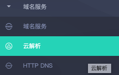
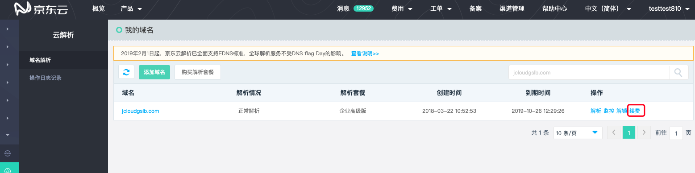
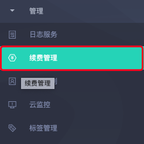
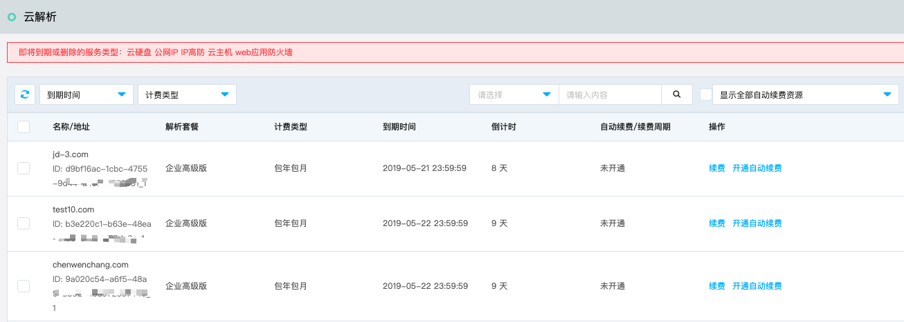

# 续费流程

本文介绍云解析的续费入口。

## 入口1：[云解析 控制台](https://dns-console.jdcloud.com/list)

1. 进入京东云控制台。

2. 通过页头导航或左侧菜单栏，依次点击 **产品** > **域名服务** > **云解析** ，进入云解析服务。

  

3. 找到需要续费的域名，在操作项中点击 **续费**，进入“续费页面”，进行续费操作

  

## 入口2：[续费管理控制台](https://renewal-console.jdcloud.com/renew/domainservice)

1. 进入京东云控制台。

2. 通过页头导航或左侧菜单栏，依次点击 **产品** > **管理** > **续费管理** ,打开“续费管理”页面。

   

3. 在“续费管理”页面，点击 **云解析**，查看 云解析 实例。

4. 在操作项中点击 **续费**，进入“续费页面”，进行续费操作

   

   ### 注意事项：

   - 云解析的续费，只针对企业版和企业高级版；

   - 只支持按年续费。

