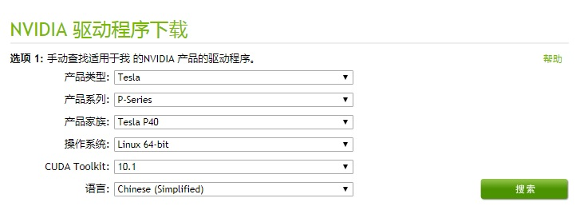
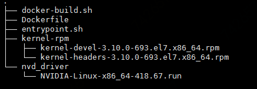

# 部署自定义版本的NVIDIA GPU驱动

在Kubernetes集群中[添加GPU节点](https://docs.jdcloud.com/cn/jcs-for-kubernetes/add-gpu)后，您需要为GPU节点安装驱动，京东云提供了基于NVIDIA-Linux-x86_64-410.104.run构建的GPU驱动镜像，您也可以参考本文部署自定义版本的NVIDIA GPU驱动。

 ## 一、下载NVDIA GPU驱动
 
 1. 访问[NVIDIA官网](https://www.nvidia.com/Download/index.aspx?lang=cn)，根据Kubernetes集群GPU工作节点对应的[GPU型号](https://docs.jdcloud.com/cn/virtual-machines/instance-type-family#user-content-6)选择适合的驱动程序版本；

 

 2. 点击“搜索”按钮，查找指定GPU卡的驱动，点击下载按钮将驱动下载到本地；本例下载的GPU驱动为NVIDIA-Linux-x86_64-410.104.run。

## 二、准备GPU驱动依赖的内核安装包

安装nvidia GPU驱动依赖kernel-devel、kernel-headers两个安装包，您需要根据GPU节点的内核版本，下载对应版本的kernel-devel、kernel-headers，详情参考如下说明。

1. 当前京东云Kubernetes集群工作节点的Kernal版本为3.10.0-693.el7.x86_64；

2. 根据kernal版本选择kernel-devel、kernel-headers安装包的版本；以3.10.0-693.el7.x86_64 kernal版本为例，将对应版本的kernel-devel和kernel-headers安装包下载到本地；

```

wget http://vault.centos.org/7.4.1708/os/x86_64/Packages/kernel-devel-3.10.0-693.el7.x86_64.rpm         #下载kernel-devel

wget http://vault.centos.org/7.4.1708/os/x86_64/Packages/kernel-headers-3.10.0-693.el7.x86_64.rpm       #kernel-headers

```

3.您也可以使用“uname -r”命令查看集群Node节点的kernal版本，并根据kernal版本直接在[centos官网](http://vault.centos.org/)下载对应版本的kernel-devel包和kernel-headers包。

## 三、构建NVDIA GPU驱动的docker镜像

1. 京东云提供了构建GPU驱动的自动化部署工具包，您可以使用如下命令将工具包下载到本地：

`
wget https://jke-component-cn-north-1.s3.cn-north-1.jdcloud-oss.com/apps/gpu/distribute/docker-image-build.tgz
`

2. 将工具包解压缩到指定目录：

```
mkdir GPUDriver/image
tar   zxvf    docker-image-build.tgz  -C GPUDriver/image            #其中GPUDriver/image可以使用其他已存在的目录替换

```

3. 在GPUDriver/image目录下新建kernel-rpm目录，并将第二步中下载的kernel-devel-3.10.0-693.el7.x86_64.rpm和kernel-headers-3.10.0-693.el7.x86_64.rpm拷贝到kernel-rpm目录：

```
mkdir GPUDriver/image/kernel-rpm          #在GPUDriver/image目录下创建kernel-rpm目录

cp kernel-devel-3.10.0-693.el7.x86_64.rpm GPUDriver/image/kernel-rpm            
cp kernel-headers-3.10.0-693.el7.x86_64.rpm GPUDriver/image/kernel-rpm
```

4. 在GPUDriver/image下新建nvd_driver目录，并将第一步中下载的NVIDIA-Linux-x86_64-410.104.run拷贝到nvd_driver目录：

```
mkdir GPUDriver/image/nvd_driver          #在GPUDriver/image目录下创建nvd_driver目录

cp NVIDIA-Linux-x86_64-410.104.run GPUDriver/image/nvd_driver      
```

5. 执行完上述步骤后，GPUDriver/image目录结构参考下图：



6. 在GPUDriver/image目录下运行docker-build.sh：

```

cd GPUDriver/image            #进入GPUDriver/image目录

sh docker-build.sh            #运行docker-build.sh
```
**注**：执行脚本前，请保证本地docker环境已安装完成

7. 脚本执行成功后，执行docker images查看生成的镜像

```
docker images

REPOSITORY      TAG                 IMAGE ID            CREATED             SIZE
nvidia-installer    v1                  fe07b1c60916        2 days ago          665MB

```
8. 将nvidia-installer镜像推送到[京东云镜像仓库](https://docs.jdcloud.com/cn/container-registry/benefits)或任何其他能够通过公网访问的镜像仓库中。

## 四、使用自定义docker镜像部署NVIDIA GPU驱动

您可以使用上一步中构建的自定义docker镜像部署NVIDIA GPU驱动。部署NVIDIA GPU驱动的Yaml文件参考[添加GPU工作节点组](https://docs.jdcloud.com/cn/jcs-for-kubernetes/add-gpu)帮助文档，文件说明如下：

```
apiVersion: apps/v1
kind: DaemonSet
metadata:
  name: nvidia-driver-installer
  namespace: kube-system
  labels:
    k8s-app: nvidia-driver-installer
spec:
  selector:
    matchLabels:
      k8s-app: nvidia-driver-installer
  updateStrategy:
    type: RollingUpdate
  template:
    metadata:
      labels:
        name: nvidia-driver-installer
        k8s-app: nvidia-driver-installer
    spec:
      affinity:
        nodeAffinity:
          requiredDuringSchedulingIgnoredDuringExecution:
            nodeSelectorTerms: 
            - matchExpressions:
              - key: jdcloud.com/jke-accelerator                #京东云为GPU Node节点默认添加的label key
                operator: In
                values: 
                - nvidia-tesla-p40              # 根据第三步中构建nvidia-installer镜像时使用的GPU Node节点类型修改对应的label value
      tolerations:
      - operator: "Exists"
      hostNetwork: true
      hostPID: true
      volumes:
      - name: dev
        hostPath:
          path: /dev
      - name: nvidia-install-dir-host
        hostPath:
          path: /home/kubernetes/bin/nvidia
      - name: root-mount
        hostPath:
          path: /
      initContainers:
      - image: ************/nvidia-installer:**               #请使用第三步中构建的nvidia-installer镜像所在镜像仓库的uri替换 
        name: nvidia-driver-installer
        securityContext:
          privileged: true
        env:
          - name: NVIDIA_INSTALL_DIR_HOST
            value: /home/kubernetes/bin/nvidia
          - name: NVIDIA_INSTALL_DIR_CONTAINER
            value: /usr/local/nvidia
          - name: ROOT_MOUNT_DIR
            value: /root
        volumeMounts:
        - name: nvidia-install-dir-host
          mountPath: /usr/local/nvidia
        - name: dev
          mountPath: /dev
        - name: root-mount
          mountPath: /root
      containers:
      - image: "jdcloud-cn-north-1.jcr.service.jdcloud.com/k8s/pause-amd64:3.1"
        name: pause
```

使用上述Yaml文件部署将NVIDIA驱动以Daemonset的方式部署到Kubernetes集群工作节点组。
