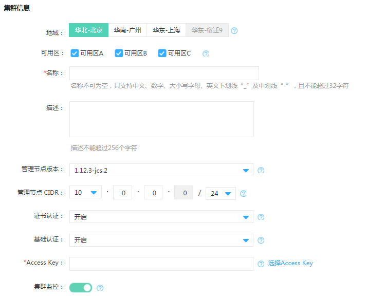

# 创建集群

## 确认地域及实例配置
**确定实例所在地域**

京东云不同地域之间完全隔离，保证不同地域间最大程度的稳定性和容错性。当前覆盖国内华北-北京、华南-广州、华东-宿迁及华东-上海四地域。

目前Kubernetes集群在华北-北京、华南-广州、华东-上海开放服务，未来我们将逐步增加更多服务地域以满足您业务需求。

选择地域时建议考虑以下几点：

 - 集群与其他京东云产品间的部署关系；
 - 不同地域之间的云产品默认不能通过内网通信；
 - 集群默认不可跨地域内网互访，默认不可跨地域访问云数据库及云缓存等；
 - 在集群中创建云硬盘类型的持久化存储时，仅支持绑定同可用区下的云硬盘；      
 - 上述内网互通是均指同一账户下的资源互通，不同账户的资源内网完全隔离。

**选择工作节点组规格配置**

正式部署业务前建议您使用按配置计费实例来进行性能测试，找到与您业务量匹配的实例规格及其他资源配置。目前Kubernetes集群工作节点组只支持按配置计费的二代实例规格，可参考[实例规格类型](https://docs.jdcloud.com/cn/virtual-machines/instance-type-family)。

## 创建集群

 1. 打开控制台，选择[弹性计算>>Kubernetes集群>>集群服务>>集群](https://cns-console.jdcloud.com/host/kubernetes/list)   
 。  
 2. 选择地域及可用区：建议您根据业务情况选择集群所在地域及可用区；默认选中指定地域下的所有可用区，推荐使用默认模式；也可取消选中某个或某几个可用区，但需要至少保证有一个可用区被选中。

 3. 设置名称、描述：名称不可为空，只支持中文、数字、大小写字母、英文下划线 “ _ ”及中划线 “ - ”，且不能超过32字符；描述为非必填项，长度不超过256字符。

 4. 管理节点版本：目前支持1.12.3版本。

 5. 管理节点CIDR：与其他私有网络的CIDR不可重叠，CIDR掩码取值范围为24 ~ 27。CIDR的设置规则参考[VPC配置](https://docs.jdcloud.com/cn/virtual-private-cloud/vpc-configuration)帮助文档。

 6. 证书认证、基础认证：默认全部开启，建议全部保留；需要至少保留一个为开启状态；
  * 证书认证：基于base64编码的证书，用于客户端到集群服务端点的认证；建议开启证书认证；
  * 基础认证：开启后允许客户端使用用户名、密码在集群服务端点认证。

 7. 添加Accesskey：选择启动状态下的Accesskey；如果无可用Access Key，请前往Access Key管理页面创建新的Access Key，并在开启状态。可参考[Accesskey管理](https://docs.jdcloud.com/cn/account-management/accesskey-management)。

 8. 集群监控：开启后将提供Kubernetes集群基础监控和集群workload自定义监控；详情参考[集群监控](https://docs.jdcloud.com/cn/jcs-for-kubernetes/cluster-monitor)。

## 新建工作节点组：  

创建新集群时需要添加一个工作节点组，在创建集群页面上即可配置工作节点组相关的参数。

  

1. 私有网络：选择部署工作节点组资源的私有网络：
  * 京东云将在选择的私有网络中新建四个子网，包括工作节点子网、Pod子网、Service子网和Service-LB子网；
  * 上述私有网络中新建的子网CIDR与私有网络中其他已创建的子网CIDR不能重叠；详情参考[子网配置](https://docs.jdcloud.com/cn/virtual-private-cloud/subnet-configuration)；
  * 工作节点组与管理节点将通过VPC对等连接网络互通，因此已选择的私有网络CIDR与管理节点CIDR不能重叠；详情参考[VPC对等连接](https://docs.jdcloud.com/cn/virtual-private-cloud/vpc-peering-configuration)；
  * 为了避免因CIDR重叠导致工作节点相关的子网无法创建，建议新建私有网络；
  * 私有网络CIDR取值范围为16 ~ 18。

2. 选择工作节点组版本：推荐选择与当前管理节点版本匹配的默认工作节点组版本；点击下拉列表显示当前管理节点版本支持的所有工作节点组版本。

3. 规格：根据具体业务情况选择不同云主机规格类型，支持云主机第二代规格和GPU型实例规格。可参考[实例规格类型](https://docs.jdcloud.com/cn/virtual-machines/instance-type-family)。

4. 数量：默认数量为3，可根据需求点击增加、减少按键或者直接输入预期节点数量；工作节点最大数量受当前地域云主机配额、工作节点CIDR可分配的内网IP数量限制。

5. 名称：默认名称为nodegroup1，名称不可为空，只支持中文、数字、大小写字母、英文下划线“_”及中划线“-”，且不能超过32字符。同一集群下的工作节点组不可重名。

6.  以下为高级选项，非必填项：  
  * 描述：描述不能超过256个字符；
  * 系统盘：本地盘，容量默认为100G，不可修改；
  * 自动修复：开启后将对非running或ready状态的工作节点进行自动修复。更多详情参考[自动修复说明](https://docs.jdcloud.com/cn/jcs-for-kubernetes/auto-repair)； 
  * 标签：设置添加到工作节点上标签的键、值；键由前缀和名称组成；前缀不超过253字符，由DNS子域名组成，每个子域名不超过63字符，且必须以小写字母数字起止，可包含“-”“.”、大小写字母和数字；名称和值均不能超过63字符，必须以大小写字母或数字起止，可包含“-”“ _ ”“.”、大小写字母和数字；最多可添加五组标签。

7. 完成相关设置后，点击确定，即可进入弹性计算>>Kubernetes集群>>集群服务>>工作节点组，查看创建的工作节点组。

