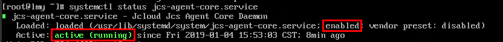
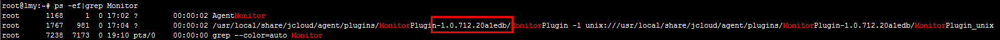
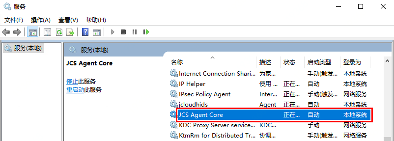
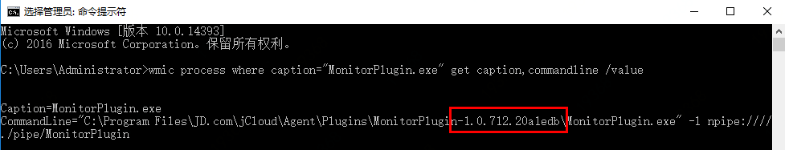
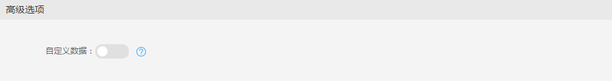
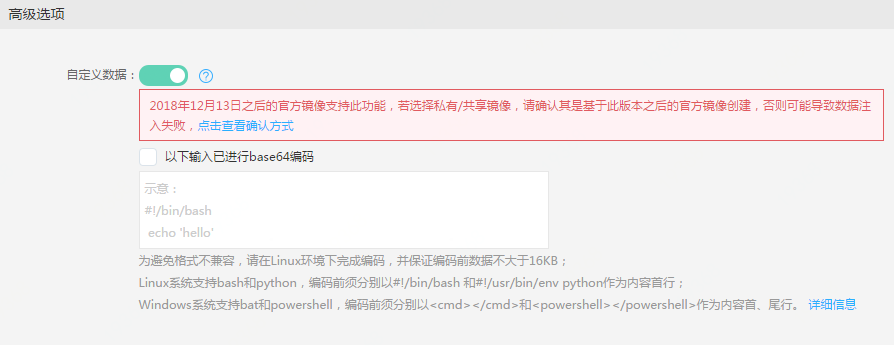

# 自定义数据（公测中）

实例自定义数据是指，在实例创建时，用户可以将可执行脚本以指定的数据格式传入实例，实现对实例启动行为的自定义。您可通过该功能，在实例启动后自动完成诸如下载/升级/安装软件、开启服务、修改系统配置、初始化服务环境等操作。<br>
自定义数据功能目前处于公测阶段，如需使用，请提交工单申请使用资格。

## 格式要求
实例自定义数据需要完成Base64编码后传入，且编码前的数据不能超过16 KB（编码后不大于21848Byte），如果通过控制台创建实例，可以不对数据进行Base64编码，勾选对应提示框后由系统完成编码，如果通过API创建，您必须自行完成编码。<br>
实例自定义数据当前支持多种脚本类型，Linux系统支持bash和python，编码前须分别以 `#!/bin/bash`和 `#!/usr/bin/env python` 作为首行内容；Windows系统支持Bat和PowerShell，编码前须分别以`<cmd>`、`</cmd>`和`<powershell>`、`</powershell>`作为内容首、尾行。以下为不同类型脚本的声明示例：
```
#!/bin/bash 
echo 'launch-1a' >> /root/text1.txt
```
```
#!/usr/bin/env python
import random
seq = list(range(1,10))
tempstr = random.sample(seq,3)
f1 = open('/root/python2-text1.txt', 'a+')
f1.writelines([str(tempstr)])
f1.close()
```
```
<cmd>
echo %random%>cmd-text1.txt
</cmd>
```
```
<powershell>
"hello" | Out-File text1.txt -Encoding utf8
</powershell>
```

      请注意：
      * 为避免格式不兼容，在使用bash或python格式脚本时，请在Linux环境下完成编码并进行调试后再行输入。


## 执行说明
* 在实例系统启动并完成网络等基本初始化配置后（新建实例或重置系统），系统将以 root 或 administrator 权限执行自定义数据；
* 首次启动之后的后续开机操作不会再次执行自定义数据；
* 自定义数据仅在实例首次启动/重置系统启动时执行，若对实例制作镜像，虽然自定义数据仍保留在镜像中，但使用镜像创建新实例时将以新指定的自定义数据为准进行执行，若不指定也不会再次执行镜像中原有自定义数据；
* 如果自定义数据没有按预期执行，可前往指定目录查看执行日志查找原因。Linux系统日志路径：/var/log/jcloud/agent；Windows系统日志路径：C:\ProgramData\JD.com\jCloud\Agent\Logs。

<div id=image-support></div>

## 镜像支持情况
自定义数据功能的实现依赖于官方镜像中默认安装的系统组件JCS-Agent，由于历史原因，官方镜像系统组件经历了多个组件多个版本的衍变，只有安装了指定版本的JCS-Agent才能保证功能的正常使用。

* 官方镜像：2018年12月14日以后使用官方镜像创建实例，均可正常使用该功能；<br>
* 私有/共享镜像：如果制作私有镜像的实例是使用官方镜像创建且创建时间不早于2018年12月14日，则使用私有/共享镜像创建实例，可正常使用该功能；<br>
* 云市场镜像：云市场镜像更新频率取决于服务商，不同镜像支持自定义数据功能的情况各异，请提交工单或联系京东云技术支持咨询。

您可以通过查看实例内JCS-Agent的版本，来确认基于当前实例制作的私有镜像是否支持此功能：<br>

### Linux系统<br>
1.确认当前实例内安装了JCS-Agent，并处于运行状态。
输入指令：
```
systemctl status jcs-agent-core.service
```
    如下图显示服务为enabled，且状态为active，则说明当前实例已安装并使用JCS-Agent。


2.确认JCS-Agent版本是 非“1.0.675.56819b0”的版本，即表明支持自定义数据功能。输入如下指令如图查看版本号：
```
 ps -ef|grep Monitor
```


### Windows系统： <br>
1.确认当前实例内安装了JCS-Agent，并处于运行状态。
    在“运行”中执行`services.msc`，查看windows运行服务，如下图显示JCSAgentCore正在运行，且启动类型为自动，则说明当前实例已安装并使用JCS-Agent。


2.确认JCS-Agent版本是 非“1.0.641.fc127b7 ”的版本，即表明支持自定义数据功能。
    在命令行工具中执行如下代码，如图可获知当前版本情况。
```
wmic process where caption="MonitorPlugin.exe" get caption,commandline /value
```


      请注意：
      * 如您当前实例内未安装JCS-Agent或当前版本不支持自定义数据，请提交工单由技服人员协助安装。

## 操作步骤
1. 访问[实例控制台](https://cns-console.jdcloud.com/host/compute/list)，或访问京东云控制台点击左侧导航栏【弹性计算】-【云主机】-【实例】进入实例列表页，点击【创建】按钮，进入云主机购买页面。
2. 选择创建实例所属地域，点击【创建】按钮进入云主机实例购买页面。
3. 选择镜像并完成其他基本配置后，在“高级选项”区域开启“自定义数据”功能。

4. 在文本框中输入自定义数据，如果数据已进行Base64编码，请勾选“以下输入已进行Base64编码”，若数据为明文未进行编码，请保持未勾选状态。

5. 为保证脚本正确执行，请务必参照上方【格式要求】检查数据首/尾行的声明格式是否正确。
6. 等待实例运行后，登录实例查看自定义数据运行结果，如执行失败请查看相关日志定位问题。Linux系统日志路径：/var/log/jcloud/agent；Windows系统日志路径：C:\ProgramData\JD.com\jCloud\Agent\Logs。


## 相关参考

[创建Linux实例](https://docs.jdcloud.com/virtual-machines/create-linux-instance)

[创建Windows实例](http://docs.jdcloud.com/virtual-machines/create-windows-instance)

