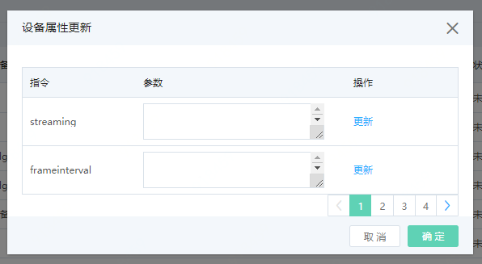

# 控制Edge子设备的开启和关闭

目前，物联网智能边缘计算支持两种方式控制子设备的开启和关闭。

## 前提条件

- 已注册京东云账号，并完成实名认证。如果还没有账号请 [注册](https://accounts.jdcloud.com/p/regPage?source=jdcloud%26ReturnUrl=%2f%2fuc.jdcloud.com%2fpassport%2fcomplete%3freturnUrl%3dhttp%3A%2F%2Fuc.jdcloud.com%2Fredirect%2FloginRouter%3FreturnUrl%3Dhttps%253A%252F%252Fwww.jdcloud.com%252Fhelp%252Fdetail%252F734%252FisCatalog%252F1)，或 [实名认证](https://uc.jdcloud.com/account/certify)。
- 已创建 物联网中心服务 实例。
- 已创建 边缘节点并部署完成边缘计算模块。

## 通过控制台下发设备状态

1. 登录 [物联网中心服务 控制台](https://iot-console.jdcloud.com/iothub)。

2. 在 设备管理 页面找到您之前部署边缘计算时创建的摄像头设备，点击右侧“设备属性更新”。

   

3. 打开设备：在streaming的参数处填入‘on’ ，点击更新

   关闭设备：在streaming的参数处填入‘off’ ，点击更新
   
4. 您可以进入您创建的用于存储边缘计算结果的OSS目录下查看。如果摄像头开启，则不断有图片和结果上传。如果摄像头关闭，则不会有数据产生。

**特别提示**：公测期间您可以在物联网智能边缘计算-边缘节点详情里，直接控制设备的开关。

## 在边缘节点控制

1. 打开边缘节点的Termail

2. 查询 metadata service 地址
    ```
    docker inspect -f '{{range .NetworkSettings.Networks}}{{.IPAddress}}{{end}}' edgex-core-metadata
    ```
   查询 command service 地址
    ```
    docker inspect -f '{{range .NetworkSettings.Networks}}{{.IPAddress}}{{end}}' edgex-core-command
    ```
3. 查询内部设备 id 和 streaming 命令 id
    ```
    curl http://${metadata_addr}:48081/api/v1/device/name/${yourdevicename}
    ```
    其中：${metadata_addr} 为上一条指令中查询出来的 metadata service 地址
         ${yourdevicename} 为您在边缘计算部署时创建的设备名称。
4. 向 command 服务发送 streaming 命令

    **打开设备**

    ```
    curl -v -H 'Content-Type: application/json' -X PUT -d '{"streaming":"on"}'http://${cmd_addr}:48082/api/v1/device/${device_id}/command/${cmd_id}   
    ```

    *命令发送成功后,设备服务收到消息, 显示log - Run camera(${yourdevicename}) ， 摄像头设备开始捕捉图片并储存在本机目录 $HOME/edgedata/${yourdevicename}下，JPEG 图片被上传到您创建的 OSS 目录下。*

    **关闭设备**

    ```
    curl -v -H 'Content-Type: application/json' -X PUT -d '{"streaming":"off"}'http://${cmd_addr}:48082/api/v1/device/${device_id}/command/${cmd_id}   
    ```

    *命令发送成功后,设备服务收到消息, 显示log - Stop camera(${yourdevicename}) ， 摄像头设备停止捕捉图片。*
    
