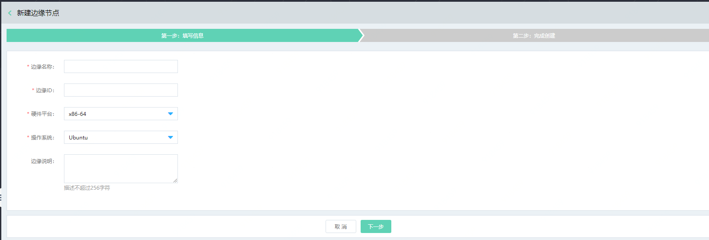
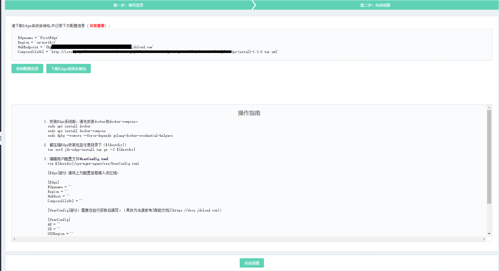

# 创建边缘计算节点

您可以通过物联网智能边缘计算控制台或 API 快速创建和注册边缘节点，关于计费说明请参见“[价格总览](../Pricing/Billing-Overview.md)”、“[计费规则](../Pricing/Billing-Rules.md)”。

本文介绍通过控制台如何创建边缘节点。

## 前提条件
- 已注册京东云账号，并完成实名认证。如果还没有账号请 [注册](https://accounts.jdcloud.com/p/regPage?source=jdcloud%26ReturnUrl=%2f%2fuc.jdcloud.com%2fpassport%2fcomplete%3freturnUrl%3dhttp%3A%2F%2Fuc.jdcloud.com%2Fredirect%2FloginRouter%3FreturnUrl%3Dhttps%253A%252F%252Fwww.jdcloud.com%252Fhelp%252Fdetail%252F734%252FisCatalog%252F1)，或 [实名认证](https://uc.jdcloud.com/account/certify)。
- 已经创建好了一个物联网中心实例。如果还没有创建，请登录 [物联网中心控制台](https://iot-console.jdcloud.com/iothub) 创建实例。

## 操作步骤
1. 登录 [物联网智能边缘计算控制台](https://iot-console.jdcloud.com/iotedge)。

2. 在“边缘节点列表”页面，点击 **新建边缘节点** ，进入“新建边缘节点”页面。

3. 在“新建边缘节点-第一步”页面，按页面提示填写相应信息。

    

    注意：公测期间，仅支持X86-64架构，Ubuntu18.04以上系统。

4. 在"新建边缘节点-第二步"页面，请下载Edge系统安装文件并妥善保存配置信息，稍后，请按照页面下方操作指南进行Edge系统的安装。

    

5. 点击**完成创建**，页面会自动跳转到 “边缘节点列表”页面，等待边缘节点创建完成，您可以在“边缘节点列表”页面查看新创建的边缘节点。

## 相关参考

- [安装Edge系统](Install-Edge-System.md)
