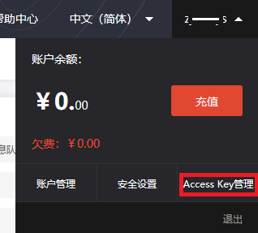
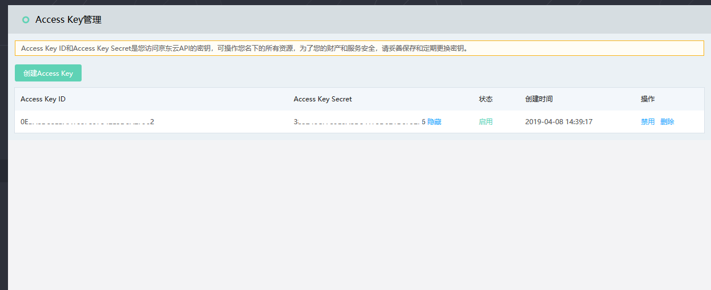
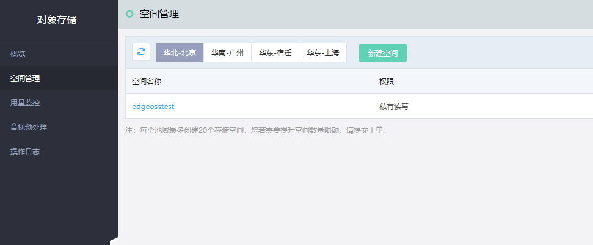
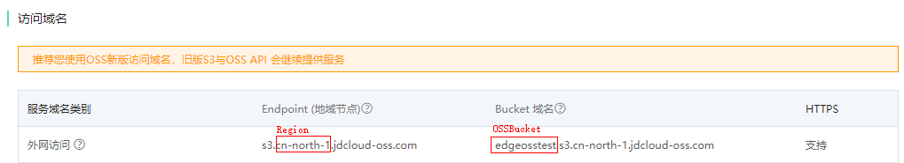

# 安装Edge系统

Edge系统需要您手动在边缘节点上进行安装和配置。

## 前提条件

- 已经完成新建边缘节点的操作，并下载好配置文件和Edge系统安装包。

  - 如未创建边缘节点，请登录 [物联网智能边缘计算控制台](https://iot-console.jdcloud.com/iotedge) 创建边缘节点
  - 如未下载Edge系统安装包或者丢失配置信息，请进入 **Edge详情** 重新下载和获取。

- 已经开通对象存储业务，并创建好一个用于存储边缘计算结果数据的Bucket。如未开通，请先进入[对象存储](https://oss-console.jdcloud.com/)控制台申请开通服务。

  

## 操作步骤

1. 安装Edge系统前，请先安装docker和docker-compose。

```
sudo apt install docker
sudo apt install docker-compose
sudo apt-get install pass
```
   并添加用户组docker，将当前用户${USER}添加至docker用户组下，当前用户${USER}可用whoami获取。
```
sudo groupadd docker
sudo gpasswd –a $(USER) docker
```
   注意：完成操作后，请重启系统。
   
2. 解压缩Edge安装包至任意目录下（${destdir}）

```
tar zxvf jdc-edge-install.tar.gz –C ${destdir}
```

3. 编辑配置文件**UserConfig.toml**

```
vim ${destdir}/sys-mgmt-agent/res/UserConfig.toml
```

   [Edge]部分:请将完成创建Edge页面下保存的配置信息填入该区域：

```
[Edge]
Edgename = ''
Region = ''
HubHost = ''
ComposefileUrl = ''
```

   [UserConfig]部分：需要您自行获取后填写。

```
[UserConfig]
AK = ''
SK = ''
OSSRegion = ''
OSSBucket = ''
```

   **其中：**

   - AK/SK ： 请登录[京东云控制台](https://console.jdcloud.com/)，点击右上角账户，如下图所示，点击Access Key管理

     

     进入Access Key 管理页面，

     

     将该页面中的AK,SK填入配置文件对应项目中。***建议:基于安全考虑，您可参考[访问控制](https://docs.jdcloud.com/cn/iam), 配置一个最小权限子账户，仅授权该Bucket的读写权限。之后，将子账户的AK/SK填入[UserConfig]。***

   - OSS部分，请进入[对象存储](https://oss-console.jdcloud.com/)页面，点击左侧空间管理

     

       点击空间名称，进入空间详情，将下图红框所示内容填入配置文件对应项目中。
     

5. 进入解压缩后的目录${destdir}，执行安装脚本，完成Edge系统安装。

```
sudo ./install.sh
```

   

## 相关参考

- [创建边缘计算节点](Create-Edgenode.md)
