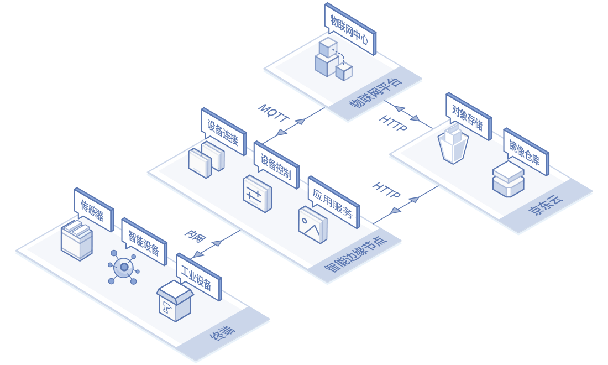
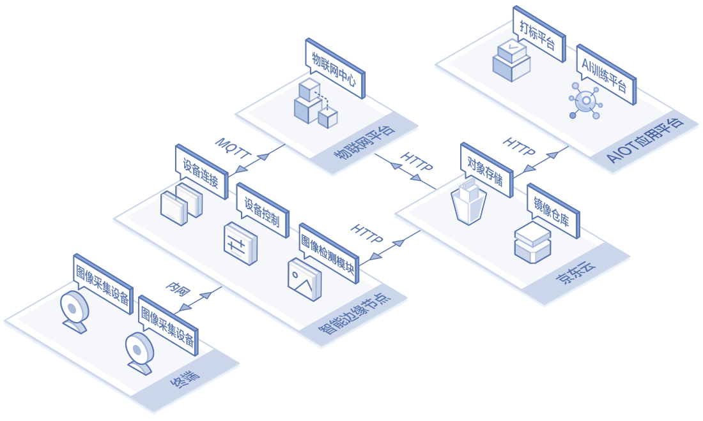

# 应用场景

以下说明物联网智能边缘计算（IoT Edge）的适用场景。

## 设备上云
通过物联网智能边缘计算（IoT Edge），您可以将各类传感器，无互联网连接能力的设备连接至边缘节点后，直接接入物联网中心服务进行管理。同时，可以将设备数据直接存储在边缘节点和京东云对象存储中。

## 图像检测
通过将图像检测模块部署到边缘节点，您可以使用您本地的摄像头设备进行图像采集，并通过不同的AI训练集对图像进行检测识别。检测结果和检测图片会自动保存至您自己的OSS中并且可再次用于打标和AI训练，以满足您不断发展的业务需求。

## 相关参考

- [产品优势](../Introduction/Benefits.md)
- [产品功能](../Introduction/Features.md)
- [价格总览](../Pricing/Price-Overview.md)
- [计费规则](../Pricing/Billing-Rules.md)
- [部署边缘计算模块](../Operation-Guide/Edge-Module/Deploy-Edge-Module.md)
- [查看边缘计算结果](../Operation-Guide/Edge-Module/View-Module-Result.md)
