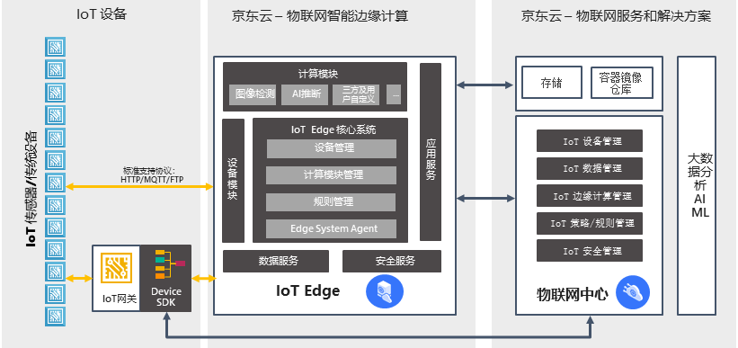

# 基础架构

物联网智能边缘计算（IoT Edge）包含核心系统、设备模块、数据服务、应用服务、安全服务以及边缘计算模块这几个核心功能。

## 业务架构

业务架构如下图：

| 名称         | 描述                                                         |
| ------------ | ------------------------------------------------------------ |
| 核心系统     | 提供整个边缘计算系统的基础运行环境，并提供设备管理，模块管理及规则管理。                         |
| 设备模块     | 提供设备连接，设备注册及设备数据采集功能                     |
| 数据服务     | 提供数据本地存储服务                         |
| 应用服务     | 使用标准协议（MQTT，HTTP）连接物联网中心和京东云服务，提供数据上行和下行功能。 |
| 安全服务     | 提供设备连接安全和本地数据安全                        |
| 边缘计算模块 | 部署在边缘节点上的计算模块，一个边缘节点可以部署多个计算模块 |

## 相关参考

- [产品优势](../Introduction/Benefits.md)
- [产品功能](../Introduction/Features.md)
- [创建边缘计算节点](../Getting-Started/Create-Edgenode.md)
- [安装Edge系统](../Getting-Started/Install-Edge-System.md)
