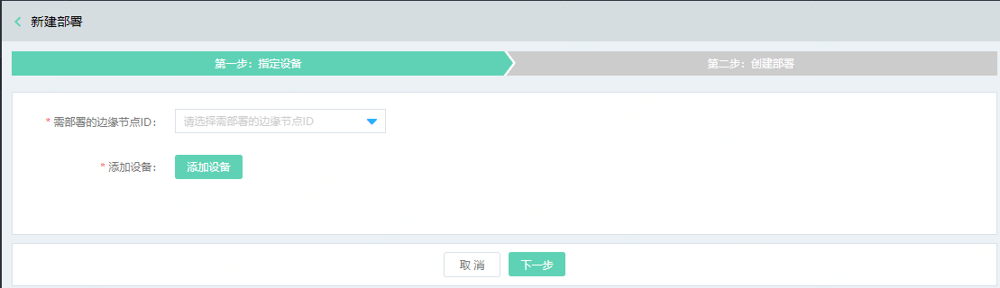
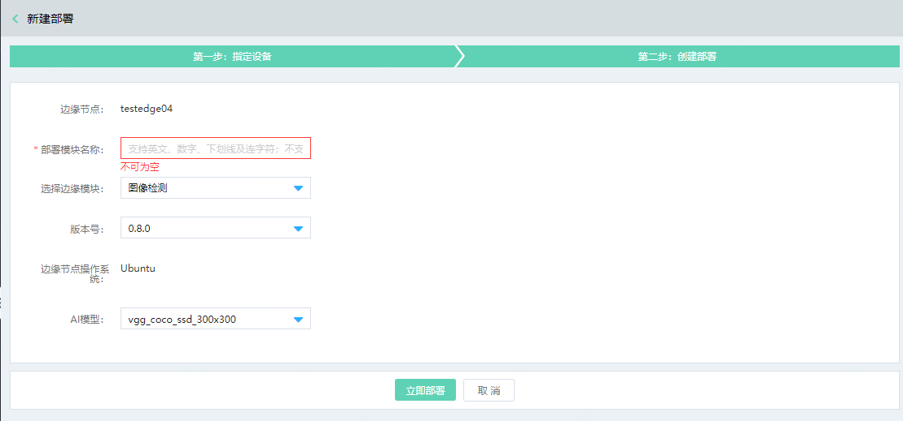

# 部署边缘计算模块

您可以通过物联网智能边缘计算控制台，进行边缘计算模块的部署。下面以我们官方提供的图像检测模块为例进行说明。

## 前提条件

- 已经完成Edge系统的安装，并且保证边缘节点在线。
- 已经开通对象存储业务，并创建好一个用于存储边缘计算结果数据的Bucket。如未开通，请先进入[对象存储](https://oss-console.jdcloud.com)控制台申请开通服务。

## 操作步骤

1. 登录 [物联网智能边缘计算控制台](https://iot-console.jdcloud.com/iotedge)。

2. 在“边缘计算列表”页面，点击 **新建部署** ，进入“新建部署”页面。

3. 在“新建部署-第一步”页面，选择需要部署的边缘节点ID，点击添加设备：添加用于边缘计算模块采集的设备。

   

4. 在“"新建部署-第二步"页面，请按页面提示填写和选择相关配置

   

   其中：

   部署模块名称：您可以对模块进行命名

   选择边缘计算模块：选择可供用于部署的计算模块，公测期间仅提供图像检测模块

   选择模块版本：选择模块版本号

   AI模型：请选择用于计算模块的AI模型。

5. 点击**立即部署**，页面会自动跳转到 “边缘计算列表”页面，您可以在“边缘计算列表”页面查看新部署的边缘节点。

   

## 相关参考

- [创建边缘计算节点](../../Getting-Started/Create-Edgenode.md)
- [安装Edge系统](../../Getting-Started/Install-Edge-System.md)
- [查看边缘计算结果](../Edge-Module/View-Module-Result.md)
                                 
