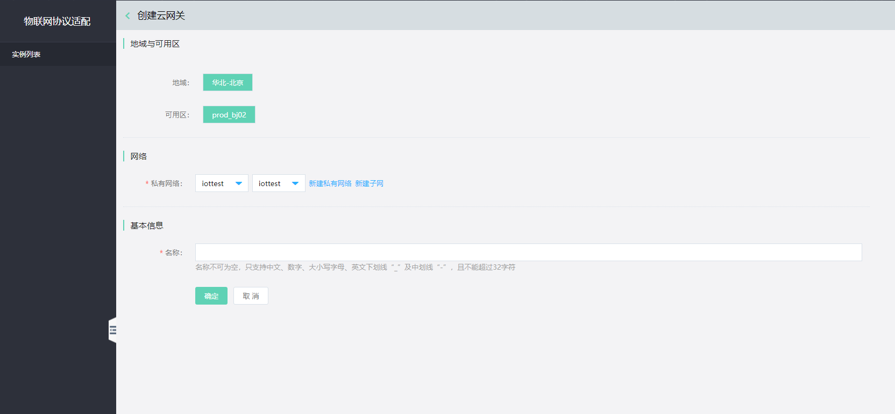

# 创建实例

您可以通过 物联网协议适配 服务   控制台或 API 快速创建 物联网协议适配 服务 。

本文介绍通过控制台如何创建 物联网协议适配 服务   实例。

## 前提条件
- 已注册京东云账号，并完成实名认证。如果还没有账号请 [注册](https://accounts.jdcloud.com/p/regPage?source=jdcloud%26ReturnUrl=%2f%2fuc.jdcloud.com%2fpassport%2fcomplete%3freturnUrl%3dhttp%3A%2F%2Fuc.jdcloud.com%2Fredirect%2FloginRouter%3FreturnUrl%3Dhttps%253A%252F%252Fwww.jdcloud.com%252Fhelp%252Fdetail%252F734%252FisCatalog%252F1)，或 [实名认证](https://uc.jdcloud.com/account/certify)。
- 请确认您的账户余额（包括代金券）不小于50元。

## 操作步骤
1. 登录 [物联网协议适配 服务   控制台](https://iot-console.jdcloud.com/iot-protocol-adaptor)。
2. 在“实例列表”页面，点击 **创建** ，进入“创建实例”页面。

    
	
3. 选择实例配置

	- 地域
	
       京东云的机房分布在全球多个位置，这些位置称为地域。物联网协议适配 服务   目前支持华北-北京，后续将支持更多地域。

	   说明：
	   - 处在同一地域的云服务产品之间通过内网互通，但不同账户的资源内网完全隔离；
	   - 处在不同地域的云服务产品之间内网不能互通；
	   - 购买云服务时建议选择最靠近您客户的地域，可降低访问时延；
	   
	- 网络
	
	   物联网协议适配 服务  支持私有网络部署。如果您当前尚未完成网络规划，请先去创建私有网络与子网。
	   
	- 基本信息
	
	    为您的服务实例创建一个名称。不同实例的名称不能相同。
4. 点击 **确认** ，进入“订单确认”页面。
6. 在“订单确认”页面，确认实例信息，并阅读《云数据库 物联网协议适配 服务   服务条款》。请点击 **立即开通** 。
7. 支付流程流程完成后，页面会自动跳转到 物联网协议适配 服务   “实例列表”页面，等待实例创建完成，您可以在“实例列表”页面查看新创建的 物联网协议适配 服务   实例。

		*注意
		公测期间物联网协议适配 服务免费，物联网中心 服务收费。以上支付流程并不会扣除您账户的余额。
