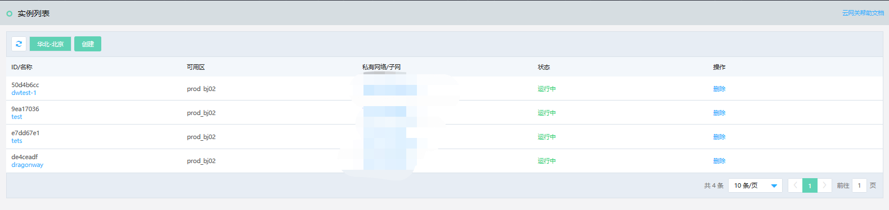

# 删除实例

您可以通过 物联网协议适配服务  控制台或 API 快速删除 物联网中心实例。

本文介绍通过控制台如何删除 物联网协议适配服务  实例。

## 前提条件
- 已注册京东云账号，并完成实名认证。如果还没有账号请 [注册](https://accounts.jdcloud.com/p/regPage?source=jdcloud%26ReturnUrl=%2f%2fuc.jdcloud.com%2fpassport%2fcomplete%3freturnUrl%3dhttp%3A%2F%2Fuc.jdcloud.com%2Fredirect%2FloginRouter%3FreturnUrl%3Dhttps%253A%252F%252Fwww.jdcloud.com%252Fhelp%252Fdetail%252F734%252FisCatalog%252F1)，或 [实名认证](https://uc.jdcloud.com/account/certify)。
- 已创建物联网协议适配服务  实例。

## 操作步骤
1. 登录 [物联网协议适配服务  控制台](https://iot-console.jdcloud.com/iot-protocol-adaptor)。
2. 在“实例列表”页面，点击 **操作** 栏位下的**删除**链接，进入“删除实例”确认页面。

    
	
3. 点击确认，确认删除实例。
4. 点击取消，取消删除实例。

