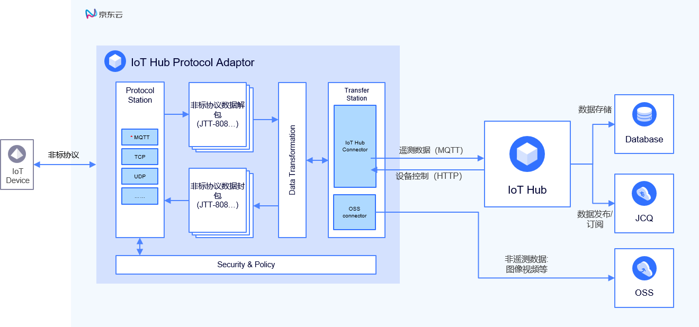

# 基础架构

物联网中心协议适配服务 包含协议引擎、数据编解码、数据处理、数据传输四个主要模块。

## 业务架构
业务架构如下图：

|名称|描述|
| - | - | 
|协议引擎| 支持使用标准协议（AMQT，MQTT，TCP或UDP）设备（但是数据格式为私有协议）连接到物联网中心协议适配服务。|
|数据编解码| 包括数据编码功能以及数据解码功能。数据解码功能将上行数据按照私有协议的格式拆包，发送给后端的物联网中心服务；数据编码功能将下行的控制指令按照私有协议的格式打包。|
|数据处理| 对数据做预处理。|
|数据传输| 传输数据，连接物联网中心服务。|

## 相关参考

- [产品优势](../Introduction/Benefits.md)
- [产品功能](../Introduction/Features.md)
- [创建实例](../Getting-Started/Create-Instance.md)
