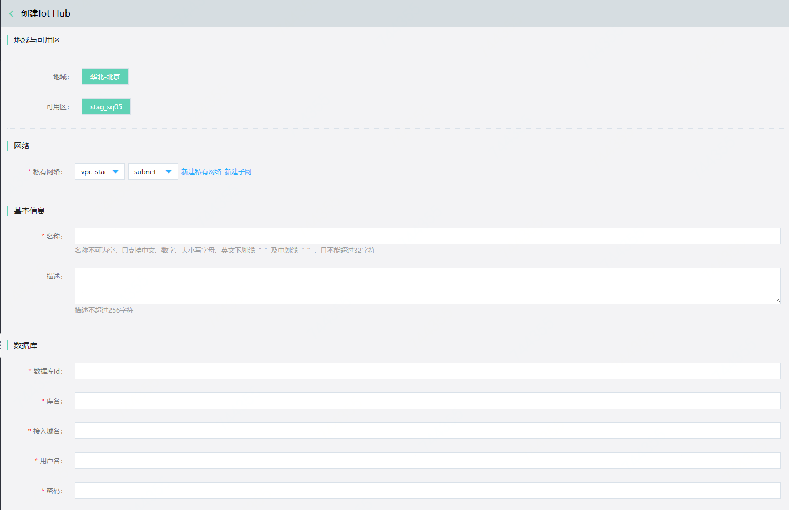
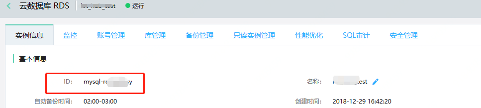
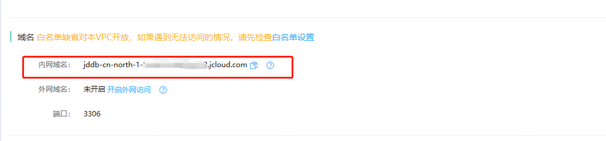
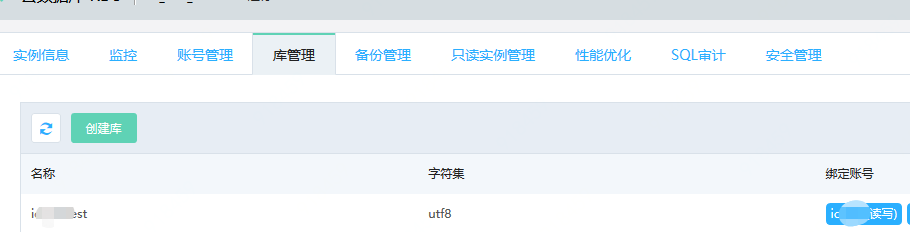

# 创建实例

您可以通过 物联网中心服务 控制台或 API 快速创建 物联网中心服务 ，关于实例的计费说明请参见“[价格总览](../Pricing/Billing-Overview.md)”、“[计费规则](../Pricing/Billing-Rules.md)”。

本文介绍通过控制台如何创建 物联网中心服务 实例。

## 前提条件

- 已注册京东云账号，并完成实名认证。如果还没有账号请 [注册](https://accounts.jdcloud.com/p/regPage?source=jdcloud%26ReturnUrl=%2f%2fuc.jdcloud.com%2fpassport%2fcomplete%3freturnUrl%3dhttp%3A%2F%2Fuc.jdcloud.com%2Fredirect%2FloginRouter%3FreturnUrl%3Dhttps%253A%252F%252Fwww.jdcloud.com%252Fhelp%252Fdetail%252F734%252FisCatalog%252F1)，或 [实名认证](https://uc.jdcloud.com/account/certify)。
- 请确认您的账户余额（包括代金券）不小于50元。

## 操作步骤

1. 登录 [物联网中心服务 控制台](https://iot-console.jdcloud.com/iothub)。

2. 在“实例列表”页面，点击 **创建** ，进入“创建实例”页面。

   

3. 选择实例配置

   - 地域

     京东云的机房分布在全球多个位置，这些位置称为地域。物联网中心服务 目前支持华北-北京，后续将支持更多地域。

     说明：

     - 处在同一地域的云服务产品之间通过内网互通，但不同账户的资源内网完全隔离；
     - 处在不同地域的云服务产品之间内网不能互通；
     - 购买云服务时建议选择最靠近您客户的地域，可降低访问时延；

   - 网络

     物联网中心服务支持私有网络部署。如果您当前尚未完成网络规划，请先去创建私有网络与子网。

   - 数据库

     物联网中心服务 实例使用数据库RDS实例存储设备登记注册信息；在配置了规则引擎转储规则后，存储设备上报的遥测数据。如果您当前尚未创建数据库RDS实例，请先去创建，然后配置RDS实例和物联网中心服务实例。

     

     说明:

     数据库实例ID：请进入您的RDS实例信息页面，找到ID项，填入后面的ID信息。

     

     内网域名：请进入您的RDS实例信息页面，找到内网域名一项，填入后面的完整域名信息。

     

     库名：进入库管理，填入您需要用于物联网中心的库名称。

     

     用户名: 填入对应库的绑定账号名。

     密码：填入对应绑定账号的密码。

     注意：

     - 数据库RDS实例所处的VPC网络设置需要和物联网中心服务的VPC网络设置一致。
     - 数据库RDS实例创建完成后，需要登录数据库RDS服务实例，初始化数据库。请使用附件的脚本 [数据库初始化脚本](../../../../image/IoT/IoT-Hub/iothub_latest.sql)

4. 点击 **确认** ，进入“订单确认”页面。

5. 在“订单确认”页面，确认实例信息，并阅读《云数据库 物联网中心服务 服务条款》。点击**立即开通**。

6. 支付流程流程完成后，页面会自动跳转到 物联网中心服务 “实例列表”页面，等待实例创建完成，您可以在“实例列表”页面查看新创建的 物联网中心服务 实例。

## 相关参考

- [计费规则](../Pricing/Billing-Rules.md)
