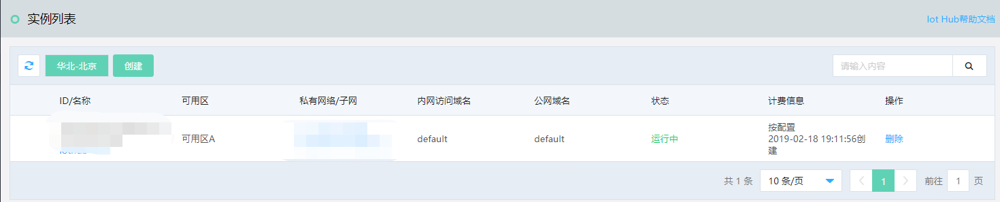

# 实例列表

您可以通过 物联网中心服务 控制台或 API 查看 物联网中心实例 ，关于实例的计费说明请参见“[价格总览](../Pricing/Billing-Overview.md)”、“[计费规则](../Pricing/Billing-Rules.md)”。

本文介绍通过控制台如何查看 物联网中心服务 实例列表。

## 前提条件
- 已注册京东云账号，并完成实名认证。如果还没有账号请 [注册](https://accounts.jdcloud.com/p/regPage?source=jdcloud%26ReturnUrl=%2f%2fuc.jdcloud.com%2fpassport%2fcomplete%3freturnUrl%3dhttp%3A%2F%2Fuc.jdcloud.com%2Fredirect%2FloginRouter%3FreturnUrl%3Dhttps%253A%252F%252Fwww.jdcloud.com%252Fhelp%252Fdetail%252F734%252FisCatalog%252F1)，或 [实名认证](https://uc.jdcloud.com/account/certify)。
- 已创建物联网中心服务 实例。

## 操作步骤
1. 登录 [物联网中心服务 控制台](https://iot-console.jdcloud.com/iothub)。
2. 在“实例列表”页面，可以查看实例名称、可用区、私有网络/子网、内网访问域名、公网域名、状态、计费信息等信息。
3. 点击实例名称链接，可以查看实例详情信息。
4. 点击私有网络/子网，可以查看私有网络/子网设置信息。

    
	

## 相关参考
- [计费规则](../Pricing/Billing-Rules.md)

